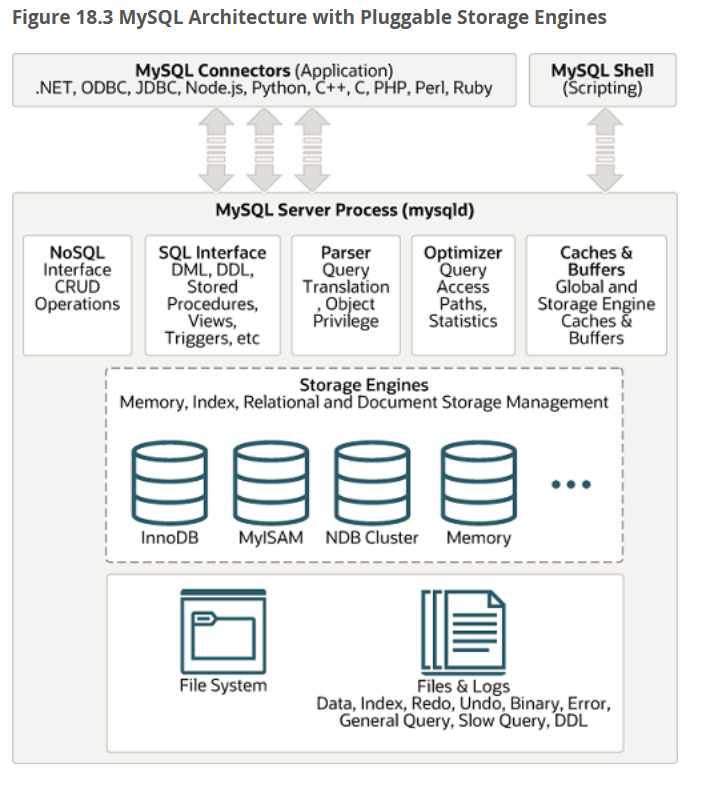
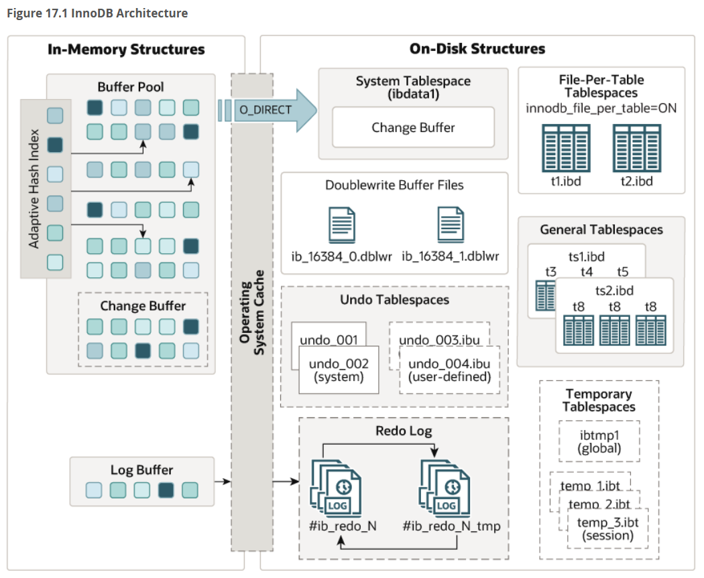

# Architektura Bazy Danych MySQL (InnoDB) - Lekcja 90 minut

## Plan lekcji (90 minut)

| Czas | Temat | Cel edukacyjny |
|------|-------|----------------|
| 0-10 min | Wstęp i cele lekcji | Przedstawienie architektury warstwowej MySQL |
| 10-25 min | Architektura MySQL i silnik InnoDB | Zrozumienie komponentów: buffer pool, logi, struktury dyskowe |
| 25-35 min | Proces nawiązywania połączenia | Handshake, autentykacja, alokacja zasobów |
| 35-55 min | Ścieżka wykonania SELECT | Parser → Optimizer → Executor → InnoDB → Buffer Pool → Dysk |
| 55-80 min | Ścieżka wykonania INSERT/UPDATE | Undo log → Buffer modify → Redo log → Doublewrite → Dysk |
| 80-90 min | Podsumowanie i zadania | Porównanie SELECT vs INSERT/UPDATE, Q&A, zadanie domowe |

---

## 1. Wstęp i cele lekcji (0-10 minut)

### Cel lekcji
Zapoznanie się z **wewnętrzną architekturę MySQL** i silnikiem InnoDB:
- Jak MySQL przetwarza zapytania SELECT krok po kroku
- Jak działa mechanizm zapisu danych (INSERT/UPDATE)
- Jakie struktury pamięci i dysku są wykorzystywane
- Jak MySQL gwarantuje spójność danych (ACID)


*"Co się dzieje, gdy wpiszecie SELECT * FROM users WHERE id=5 i naciśniecie Enter?"*

**Rzeczywistość**: Zapytanie przechodzi przez ~10 etapów, wykorzystuje pamięć RAM (buffer pool), indeksy B-tree, logi transakcyjne, a często w ogóle nie sięga na dysk!

---

## 2. Architektura MySQL i silnik InnoDB (10-25 minut)

### 2.1 Architektura warstwowa MySQL

MySQL składa się z dwóch głównych warstw:

```
┌─────────────────────────────────────────┐
│   WARSTWA SERWERA MYSQL                 │
│  - Connection Handling                  │
│  - Parser (składnia SQL)                │
│  - Optimizer (optymalizator zapytań)    │
│  - Query Cache (deprecated w MySQL 8.0) │
└─────────────────────────────────────────┘
              ↓
┌─────────────────────────────────────────┐
│   SILNIK SKŁADOWANIA (Storage Engine)   │
│        InnoDB (domyślny)                │
│  - Zarządzanie danymi na dysku          │
│  - Transakcje (ACID)                    │
│  - Blokady (row-level locking)          │
└─────────────────────────────────────────┘
```


**Ważne**: MySQL może używać różnych silników (MyISAM, Memory, CSV), ale **InnoDB** to standard od MySQL 5.5+ ze względu na transakcje i integralność danych.

### 2.2 Kluczowe komponenty InnoDB

#### A) **Buffer Pool** (pamięć RAM)
- **Rozmiar**: Domyślnie 128MB, w produkcji 50-80% RAM serwera
- **Zadanie**: Cache stron danych (pages) i indeksów
- **Mechanizm**: LRU (Least Recently Used) z modyfikacjami
- **Podział**:
  - **Clean pages** - zsynchronizowane z dyskiem
  - **Dirty pages** - zmodyfikowane, czekają na zapis

```sql
-- Sprawdzenie rozmiaru buffer pool
SHOW VARIABLES LIKE 'innodb_buffer_pool_size';
-- Wynik: 134217728 (128MB = 128*1024*1024 bajtów)
```

#### B) **Redo Log** (Write-Ahead Logging)
- **Pliki**: `ib_logfile0`, `ib_logfile1` (rotacja)
- **Zadanie**: Zapisuje WSZYSTKIE zmiany przed modyfikacją danych
- **Gwarancja**: Durability (D w ACID) - dane przetrwają crash
- **Proces**: 
  1. Zmiana zapisana do redo log buffer
  2. COMMIT → fsync redo log na dysk
  3. Dopiero później dirty pages → dysk

```sql
SHOW VARIABLES LIKE 'innodb_log_file%';
-- innodb_log_file_size: 50331648 (48MB)
-- innodb_log_files_in_group: 2
```

#### C) **Undo Log** (MVCC - Multi-Version Concurrency Control)
- **Zadanie**: Przechowuje stare wersje rekordów
- **Zastosowanie**:
  - ROLLBACK transakcji
  - Consistent reads (izolacja READ COMMITTED/REPEATABLE READ)
- **Lokalizacja**: System tablespace lub separate undo tablespaces

#### D) **Doublewrite Buffer**
- **Problem**: Częściowy zapis strony (partial page write) podczas crash
- **Rozwiązanie**: 
  1. Zapisz dirty page do doublewrite buffer (sekwencyjnie)
  2. fsync doublewrite buffer
  3. Zapisz do docelowej lokalizacji w .ibd
- **Ochrona**: Atomic writes na poziomie 16KB stron

#### E) **Change Buffer**
- **Zadanie**: Buforuje zmiany w indeksach **nieklastrowanych** (secondary indexes)
- **Kiedy**: Gdy strona indeksu nie jest w buffer pool
- **Merge**: Podczas ładowania strony lub background merge

#### F) **Adaptive Hash Index**
- **Automatyczny**: InnoDB monitoruje wzorce dostępu
- **Cel**: Hash index dla gorących rekordów (O(1) zamiast O(log n))
- **Warunek**: Strona często czytana z tym samym kluczem

### 2.3 Struktury na dysku

```
MySQL Data Directory/
├── ibdata1              # System tablespace (undo logs, doublewrite buffer)
├── ib_logfile0          # Redo log #1
├── ib_logfile1          # Redo log #2
└── database_name/
    ├── table1.ibd       # File-per-table tablespace (dane + indeksy)
    └── table2.ibd
```

**Strona (Page)**: Podstawowa jednostka I/O = **16KB**
- Zawiera wiersze danych lub węzły indeksu B-tree
- Buffer pool operuje na stronach

---

## 3. Proces nawiązywania połączenia (25-35 minut)

### 3.1 TCP Handshake i autentykacja

**Krok 1: Klient inicjuje połączenie**
```bash
mysql -u admin -p -h 192.168.1.100
```

**Krok 2: TCP 3-way handshake**
```
Klient                    Serwer MySQL (port 3306)
  |                              |
  |-------- SYN ---------------->|
  |<------- SYN-ACK -------------|
  |-------- ACK ---------------->|
  |     (połączenie TCP OK)      |
```

**Krok 3: MySQL Handshake (protocol v10)**
```
Serwer → Klient: Initial Handshake Packet
  - Protocol version: 10
  - Server version: "8.0.35-MySQL"
  - Thread ID: 42
  - Auth plugin: caching_sha2_password
  - Salt (20 bajtów) dla hashowania hasła

Klient → Serwer: Handshake Response
  - Username: "admin"
  - Password hash: SHA256(SHA256(password) + salt)
  - Database: "shop"
  - Client capabilities: LONG_PASSWORD, TRANSACTIONS, etc.

Serwer → Klient: OK Packet (jeśli auth OK) lub ERR Packet
```

**Krok 4: Alokacja zasobów**
- Utworzenie wątku obsługi (thread pool lub thread-per-connection)
- Alokacja bufora sieciowego (`net_buffer_length` = 16KB)
- Przypisanie thread_id

```sql
-- Sprawdzenie aktywnych połączeń
SHOW PROCESSLIST;
-- Wynik:
-- Id | User  | Host           | db   | Command | Time | State
-- 42 | admin | 192.168.1.5:51234 | shop | Sleep   | 10   | 
```

### 3.2 Interaktywna demonstracja

**Zadanie dla uczniów**: Nawiążcie połączenie i sprawdźcie thread_id

```sql
SELECT CONNECTION_ID();  -- Zwraca Twój thread_id

SHOW STATUS LIKE 'Threads_connected';
-- Threads_connected: 5 (aktualna liczba połączeń)

SHOW VARIABLES LIKE 'max_connections';
-- max_connections: 151 (limit równoczesnych połączeń)
```

---

## 4. Pełna ścieżka wykonania SELECT (35-55 minut)

### 4.1 Przykładowe zapytanie

```sql
SELECT name, email 
FROM users 
WHERE id = 1234;
```

**Założenia**:
- Tabela `users`: 1 milion wierszy
- Primary key: `id` (clustered index)
- Secondary index: `idx_email` na kolumnie `email`

### 4.2 Etapy wykonania SELECT

```
┌──────────────────────────────────────────────────────────┐
│ 1. CLIENT → SERVER: COM_QUERY packet                    │
│    Payload: "SELECT name, email FROM users WHERE id=1234" │
└──────────────────────────────────────────────────────────┘
                        ↓
┌──────────────────────────────────────────────────────────┐
│ 2. PARSER (Lexer + Syntax Check)                        │
│    - Tokenizacja: SELECT | name | , | email | FROM ...  │
│    - Sprawdzenie składni SQL                             │
│    - Budowa Parse Tree (drzewo składniowe)              │
└──────────────────────────────────────────────────────────┘
                        ↓
┌──────────────────────────────────────────────────────────┐
│ 3. PREPROCESSOR                                          │
│    - Rozwiązanie nazw tabel (users → db.users)          │
│    - Sprawdzenie uprawnień (SELECT privilege)            │
│    - Walidacja kolumn (czy name, email istnieją?)       │
└──────────────────────────────────────────────────────────┘
                        ↓
┌──────────────────────────────────────────────────────────┐
│ 4. OPTIMIZER (Kluczowy etap!)                            │
│    - Analiza możliwych planów wykonania:                 │
│      Plan A: Full table scan (1M rows)                   │
│      Plan B: Primary key lookup (1 row) ← WYBRANY       │
│    - Statystyki tabel (ANALYZE TABLE)                    │
│    - Koszt I/O: Plan B = 1 page read                    │
└──────────────────────────────────────────────────────────┘
                        ↓
┌──────────────────────────────────────────────────────────┐
│ 5. EXECUTOR → InnoDB Handler                             │
│    Wywołanie: ha_innobase::index_read()                  │
│    Argumenty: key=1234, index=PRIMARY                    │
└──────────────────────────────────────────────────────────┘
                        ↓
┌──────────────────────────────────────────────────────────┐
│ 6. InnoDB: Adaptive Hash Index Check                     │
│    - Sprawdzenie AHI: czy page dla id=1234 jest "gorąca"?│
│    - Jeśli TAK → bezpośredni wskaźnik do page (O(1))    │
│    - Jeśli NIE → B-tree lookup (O(log n))               │
└──────────────────────────────────────────────────────────┘
                        ↓
┌──────────────────────────────────────────────────────────┐
│ 7. InnoDB: Buffer Pool Lookup                            │
│    - Hash tablicy: page_id → RAM address                │
│    - Jeśli HIT → czytaj z RAM (bardzo szybko!)          │
│    - Jeśli MISS → idź do kroku 8                        │
└──────────────────────────────────────────────────────────┘
                        ↓
┌──────────────────────────────────────────────────────────┐
│ 8. InnoDB: Disk Read (.ibd file)                         │
│    - Odczyt strony z pliku users.ibd                     │
│    - Lokalizacja: B-tree navigation (root → branch → leaf)│
│    - I/O: fread() 16KB page                              │
│    - Umieszczenie page w Buffer Pool (LRU list)          │
└──────────────────────────────────────────────────────────┘
                        ↓
┌──────────────────────────────────────────────────────────┐
│ 9. InnoDB: Row Retrieval                                 │
│    - Odczyt rekordu z page (id=1234, name="Jan Kowalski")│
│    - MVCC check: czy rekord widoczny dla tej transakcji? │
│    - Zwrot danych do Executora                           │
└──────────────────────────────────────────────────────────┘
                        ↓
┌──────────────────────────────────────────────────────────┐
│ 10. EXECUTOR → CLIENT: Result Set                        │
│    - Pakiet wynikowy: 1 row (name, email)                │
│    - Network buffer → TCP send                           │
│    - EOF packet (koniec wyników)                         │
└──────────────────────────────────────────────────────────┘
```

### 4.3 EXPLAIN - analiza planu wykonania

**Zadanie praktyczne**: Sprawdźmy, co MySQL planuje zrobić

```sql
EXPLAIN SELECT name, email FROM users WHERE id = 1234;
```

**Wynik (format tabeli)**:
```
+----+-------------+-------+-------+---------------+---------+---------+-------+------+-------+
| id | select_type | table | type  | possible_keys | key     | key_len | ref   | rows | Extra |
+----+-------------+-------+-------+---------------+---------+---------+-------+------+-------+
|  1 | SIMPLE      | users | const | PRIMARY       | PRIMARY | 4       | const |    1 | NULL  |
+----+-------------+-------+-------+---------------+---------+---------+-------+------+-------+
```

**Interpretacja**:
- `type: const` - najlepszy możliwy typ dostępu (lookup po PK)
- `key: PRIMARY` - użyty indeks
- `rows: 1` - szacowana liczba wierszy do sprawdzenia
- `Extra: NULL` - brak dodatkowych operacji (np. filesort)

**Format JSON (bardziej szczegółowy)**:
```sql
EXPLAIN FORMAT=JSON 
SELECT name, email FROM users WHERE id = 1234\G
```

**Wynik**:
```json
{
  "query_block": {
    "select_id": 1,
    "cost_info": {
      "query_cost": "1.00"  ← Koszt w jednostkach I/O
    },
    "table": {
      "table_name": "users",
      "access_type": "const",  ← Najlepszy typ
      "possible_keys": ["PRIMARY"],
      "key": "PRIMARY",
      "used_key_parts": ["id"],
      "key_length": "4",
      "ref": ["const"],
      "rows_examined_per_scan": 1,
      "rows_produced_per_join": 1,
      "filtered": "100.00",
      "cost_info": {
        "read_cost": "0.00",
        "eval_cost": "0.10",
        "prefix_cost": "0.00",
        "data_read_per_join": "1K"
      },
      "used_columns": ["id", "name", "email"]
    }
  }
}
```

### 4.4 Typy skanowania (access_type)

| Type | Opis | Wydajność |
|------|------|-----------|
| `const` | Lookup po PRIMARY/UNIQUE (1 wiersz) | ⭐⭐⭐⭐⭐ Doskonała |
| `eq_ref` | JOIN z unikalnym indeksem | ⭐⭐⭐⭐ Bardzo dobra |
| `ref` | Lookup po indeksie nieklastrowanym | ⭐⭐⭐ Dobra |
| `range` | Skan zakresu (WHERE id BETWEEN 1 AND 100) | ⭐⭐ Średnia |
| `index` | Full index scan (czyta cały indeks) | ⭐ Słaba |
| `ALL` | Full table scan (czyta całą tabelę!) | ❌ Zła |

**Ćwiczenie dla klasy**: Porównajmy plany

```sql
-- Plan A: Użycie PRIMARY KEY
EXPLAIN SELECT * FROM users WHERE id = 5;
-- type: const, rows: 1

-- Plan B: Brak indeksu
EXPLAIN SELECT * FROM users WHERE phone = '123456789';
-- type: ALL, rows: 1000000 (zakładając brak indeksu na phone)

-- Zadanie: Dodajcie indeks i porównajcie!
CREATE INDEX idx_phone ON users(phone);
EXPLAIN SELECT * FROM users WHERE phone = '123456789';
-- type: ref, rows: 1
```

### 4.5 Clustered vs Secondary Index

**Clustered Index (PRIMARY KEY)**:
- Dane fizycznie posortowane według klucza
- Leaf nodes zawierają **cały wiersz danych**
- InnoDB: zawsze istnieje (jeśli brak PK → GEN_CLUST_INDEX)

**Secondary Index**:
- Leaf nodes zawierają **klucz PK** (nie cały wiersz)
- Wymaga **dwóch lookup'ów**: secondary idx → PK → dane

```sql
-- Przykład: Secondary index lookup
SELECT name FROM users WHERE email = 'jan@example.com';

-- Krok 1: Skan idx_email → znajdź PK (id=1234)
-- Krok 2: Skan PRIMARY → odczytaj row (id=1234, name="Jan Kowalski")
```

**Zadanie do dyskusji**: Dlaczego `SELECT id FROM users WHERE email = 'jan@example.com'` może być szybszy?  
**Odpowiedź**: Covering index - wynik w leaf node secondary index, brak kroku 2!

---

## 5. Pełna ścieżka wykonania INSERT/UPDATE (55-80 minut)

### 5.1 Przykładowe zapytanie INSERT

```sql
INSERT INTO users (id, name, email, created_at) 
VALUES (9999, 'Anna Nowak', 'anna@example.com', NOW());
```

### 5.2 Etapy wykonania INSERT (szczegółowo)

```
┌──────────────────────────────────────────────────────────┐
│ 1. CLIENT → SERVER: COM_QUERY packet                    │
└──────────────────────────────────────────────────────────┘
                        ↓
┌──────────────────────────────────────────────────────────┐
│ 2. PARSER + PREPROCESSOR                                 │
│    - Walidacja składni                                   │
│    - Sprawdzenie uprawnień INSERT                        │
└──────────────────────────────────────────────────────────┘
                        ↓
┌──────────────────────────────────────────────────────────┐
│ 3. OPTIMIZER (prosty plan dla INSERT)                    │
│    - Sprawdzenie constraintów (PRIMARY KEY, UNIQUE)      │
│    - Alokacja AUTO_INCREMENT (jeśli dotyczy)             │
└──────────────────────────────────────────────────────────┘
                        ↓
┌──────────────────────────────────────────────────────────┐
│ 4. TRANSAKCJA: BEGIN (implicit)                          │
│    - Alokacja transaction ID (TRX_ID)                    │
│    - Przypisanie Undo Log Segment                        │
└──────────────────────────────────────────────────────────┘
                        ↓
┌──────────────────────────────────────────────────────────┐
│ 5. UNDO LOG: Zapis przed-obrazu (before-image)           │
│    - Typ: TRX_UNDO_INSERT_REC                            │
│    - Dane: NULL (INSERT nie ma poprzedniej wersji)       │
│    - Cel: Umożliwienie ROLLBACK                          │
│    - Lokalizacja: System tablespace lub undo tablespace  │
└──────────────────────────────────────────────────────────┘
                        ↓
┌──────────────────────────────────────────────────────────┐
│ 6. BUFFER POOL: Ładowanie stron do modyfikacji           │
│    - Wczytanie leaf page PRIMARY KEY (jeśli nie w cache) │
│    - Wczytanie leaf pages SECONDARY INDEXES              │
│    - Strony oznaczone jako DIRTY (zmodyfikowane)         │
└──────────────────────────────────────────────────────────┘
                        ↓
┌──────────────────────────────────────────────────────────┐
│ 7. BUFFER POOL: Wstawienie rekordu (in-memory)           │
│    - Modyfikacja B-tree PRIMARY KEY                      │
│    - Dodanie rekordu: (id=9999, name="Anna Nowak", ...)  │
│    - TRX_ID = transaction_id tej transakcji              │
│    - ROLL_PTR = wskaźnik do undo log                     │
└──────────────────────────────────────────────────────────┘
                        ↓
┌──────────────────────────────────────────────────────────┐
│ 8. CHANGE BUFFER: Secondary indexes (opcjonalnie)        │
│    - Jeśli strona idx_email NIE w buffer pool:           │
│      → Zapis zmiany do Change Buffer (delayed insert)    │
│    - Jeśli strona W buffer pool:                         │
│      → Bezpośrednia modyfikacja                          │
└──────────────────────────────────────────────────────────┘
                        ↓
┌──────────────────────────────────────────────────────────┐
│ 9. REDO LOG BUFFER: Write-Ahead Logging                  │
│    - Zapisanie WSZYSTKICH zmian:                         │
│      • MLOG_REC_INSERT: "inserted row id=9999 into page X"│
│      • MLOG_INDEX_INSERT: "updated idx_email page Y"     │
│    - Format: LSN (Log Sequence Number) + operacja        │
│    - Lokalizacja: PAMIĘĆ (redo log buffer)               │
└──────────────────────────────────────────────────────────┘
                        ↓
┌──────────────────────────────────────────────────────────┐
│ 10. COMMIT: Trwałość zapisu (Durability)                 │
│    - Flush redo log buffer → ib_logfile* (fsync!)        │
│    - Parametr: innodb_flush_log_at_trx_commit=1          │
│      1 = fsync po każdym COMMIT (najbezpieczniej)        │
│      2 = flush do OS cache (ryzyko utraty ~1s danych)    │
│    - COMMIT zakończony → OK packet do klienta            │
└──────────────────────────────────────────────────────────┘
                        ↓
┌──────────────────────────────────────────────────────────┐
│ 11. BACKGROUND: Master Thread (asynchronicznie)           │
│    - Dirty pages czekają w Buffer Pool                   │
│    - Master Thread co 1-10 sekund:                       │
│      a) Page Cleaner Thread: dirty pages → dysk          │
│      b) Doublewrite Buffer: atomic write protection      │
│      c) Checkpoint: aktualizacja LSN na dysku            │
└──────────────────────────────────────────────────────────┘
                        ↓
┌──────────────────────────────────────────────────────────┐
│ 12. DOUBLEWRITE BUFFER: Ochrona przed partial write      │
│    Proces zapisu dirty page:                             │
│    a) Zapis page → doublewrite buffer (128 pages, 2MB)   │
│    b) fsync doublewrite buffer                           │
│    c) Zapis page → docelowa lokalizacja w users.ibd     │
│    d) fsync users.ibd                                    │
│    Jeśli crash w kroku (c) → odtworzenie z doublewrite   │
└──────────────────────────────────────────────────────────┘
                        ↓
┌──────────────────────────────────────────────────────────┐
│ 13. DISK WRITE: Ostateczny zapis                         │
│    - Strona zapisana w users.ibd                         │
│    - Oznaczenie jako CLEAN w buffer pool                 │
│    - LSN page = LSN redo log (spójność)                  │
└──────────────────────────────────────────────────────────┘
```

### 5.3 UPDATE - dodatkowe kroki (MVCC)

```sql
UPDATE users SET email = 'nowy@example.com' WHERE id = 1234;
```

**Różnice względem INSERT**:

```
┌──────────────────────────────────────────────────────────┐
│ 5a. UNDO LOG: Zapis starej wersji (MVCC!)                │
│    - Typ: TRX_UNDO_UPD_EXIST_REC                         │
│    - Przed-obraz: (id=1234, email="stary@example.com")   │
│    - Cel:                                                │
│      • ROLLBACK transakcji                               │
│      • Consistent read (SELECT w innych transakcjach)    │
└──────────────────────────────────────────────────────────┘
                        ↓
┌──────────────────────────────────────────────────────────┐
│ 6a. BUFFER POOL: Aktualizacja rekordu                    │
│    - Stara wersja → undo log                             │
│    - Nowa wersja w głównym rekordzie:                    │
│      (id=1234, email="nowy@example.com")                 │
│    - TRX_ID = ID bieżącej transakcji                     │
│    - ROLL_PTR = wskaźnik do undo log (łańcuch wersji)    │
└──────────────────────────────────────────────────────────┘
```

**MVCC w akcji** - równoległe transakcje:

```sql
-- Transakcja A (TRX_ID=100):
BEGIN;
UPDATE users SET email = 'nowy@example.com' WHERE id = 1234;
-- NIE MA COMMIT!

-- Transakcja B (TRX_ID=101):
BEGIN;
SELECT email FROM users WHERE id = 1234;
-- Wynik: "stary@example.com" (czyta z undo log!)
-- Dlaczego? Transakcja B rozpoczęła się przed COMMIT A
-- Poziom izolacji: REPEATABLE READ (domyślny w InnoDB)
```

### 5.4 Parametry konfiguracyjne InnoDB

```sql
-- Kluczowe parametry wpływające na wydajność zapisu
SHOW VARIABLES LIKE 'innodb_flush_log_at_trx_commit';
-- Wartość: 1 (fsync po każdym COMMIT)
-- 0 = flush co 1s (szybko, ale ryzyko utraty danych)
-- 1 = fsync po każdym COMMIT (bezpiecznie, wolniej)
-- 2 = flush do OS cache (kompromis)

SHOW VARIABLES LIKE 'innodb_flush_method';
-- Wartość: fsync / O_DIRECT (Linux)
-- O_DIRECT = omija OS cache (mniej kopii danych)

SHOW VARIABLES LIKE 'innodb_doublewrite';
-- Wartość: ON (ochrona przed partial write)

SHOW VARIABLES LIKE 'innodb_log_buffer_size';
-- Wartość: 16777216 (16MB redo log buffer)
```

### 5.5 Monitorowanie InnoDB w czasie rzeczywistym

**Komenda do zaawansowanego monitoringu**:

```sql
SHOW ENGINE INNODB STATUS\G
```

**Fragment wyniku (najważniejsze sekcje)**:

```
=====================================
2024-02-07 14:35:22 INNODB MONITOR OUTPUT
=====================================

-------------------------------------
BACKGROUND THREAD
-------------------------------------
srv_master_thread loops: 1234 srv_active, 0 srv_shutdown, 56789 srv_idle
srv_master_thread log flush and writes: 57023

----------------------
BUFFER POOL AND MEMORY
----------------------
Total large memory allocated 137428992
Dictionary memory allocated 123456
Buffer pool size   8191      ← Liczba stron (8191 * 16KB = ~128MB)
Free buffers       1024      ← Wolne strony
Database pages     7100      ← Strony z danymi
Old database pages 2621
Modified db pages  234       ← DIRTY PAGES (czekają na zapis!)
Pending reads      0
Pending writes: LRU 0, flush list 0, single page 0
Pages made young 12345, not young 67890
Pages read 1234567, created 4321, written 5678

---
LOG
---
Log sequence number 123456789012    ← Aktualny LSN
Log flushed up to   123456789000    ← Zapisany do redo log
Pages flushed up to 123456780000    ← Zapisany do .ibd
Last checkpoint at  123456770000    ← Ostatni checkpoint
```

**Analiza**:
- **Modified db pages: 234** → 234 dirty pages (234 * 16KB = 3.7MB) czeka na zapis
- **LSN gap** (123456789012 - 123456770000) = ok. 19KB zmian do recovery w razie crash

### 5.6 Praktyczne testy wydajności

**Ćwiczenie dla uczniów**: Porównanie INSERT vs SELECT

```sql
-- Test 1: Masowy INSERT (10,000 wierszy)
DELIMITER $$
CREATE PROCEDURE insert_test()
BEGIN
  DECLARE i INT DEFAULT 0;
  START TRANSACTION;
  WHILE i < 10000 DO
    INSERT INTO test_table (name, value) VALUES (CONCAT('User', i), RAND());
    SET i = i + 1;
  END WHILE;
  COMMIT;
END$$
DELIMITER ;

-- Wywołanie
SET profiling = 1;
CALL insert_test();
SHOW PROFILES;
-- Wynik: ~2-5 sekund (zależnie od sprzętu)

-- Test 2: Masowy SELECT (10,000 wierszy)
SELECT * FROM test_table LIMIT 10000;
SHOW PROFILES;
-- Wynik: ~0.1-0.5 sekundy (Buffer Pool cache!)
```

**Obserwacja**: SELECT jest 10-20x szybszy niż INSERT, ponieważ:
- SELECT: Buffer pool cache hit → brak I/O
- INSERT: Redo log fsync, dirty pages, undo logs

---

## 6. Podsumowanie i porównanie (80-90 minut)

### 6.1 Tabela porównawcza SELECT vs INSERT/UPDATE

| Aspekt | SELECT | INSERT/UPDATE |
|--------|--------|---------------|
| **Fazy** | Parser → Optimizer → Buffer Pool → Dysk (opcjonalnie) | Parser → **Undo log** → Buffer Pool → **Redo log** → COMMIT → Background flush |
| **Buffer Pool** | Tylko odczyt (cache hit/miss) | Modyfikacja (dirty pages) |
| **Transakcje** | Nie wymaga (autocommit) | Wymaga (BEGIN...COMMIT) |
| **Undo Log** | Nie używany | Zapisuje starą wersję (MVCC) |
| **Redo Log** | Nie używany | Zapisuje wszystkie zmiany (WAL) |
| **Doublewrite Buffer** | Nie dotyczy | Ochrona przed partial write |
| **fsync()** | Nie dotyczy | COMMIT wymaga fsync redo log! |
| **Wydajność** | Bardzo szybki (cache hit ~0.01ms) | Wolniejszy (fsync ~1-10ms) |
| **Concurrent Reads** | Brak blokad (MVCC) | Możliwe (MVCC), ale row-level locks |

### 6.2 Kluczowe wnioski

**1. Dlaczego SELECT jest szybki?**
- Buffer Pool eliminuje I/O do dysku
- Adaptive Hash Index przyspiesza lookup'y
- Brak transakcji = brak overhead

**2. Dlaczego INSERT/UPDATE jest wolniejszy?**
- **Durability** (ACID) wymaga fsync redo log
- Undo log dla MVCC
- Doublewrite buffer dla atomowości
- Background flush dirty pages

**3. Jak przyspieszyć INSERT/UPDATE?**
- Batch inserts w jednej transakcji (10,000 rows)
- Zmniejszenie `innodb_flush_log_at_trx_commit` (ryzyko!)
- Zwiększenie `innodb_log_buffer_size`
- SSD zamiast HDD (fsync 100x szybszy!)

### 6.3 Pytania kontrolne do klasy

1. **Co zawiera redo log?** (Odpowiedź: Wszystkie zmiany danych przed zapisem do .ibd)
2. **Po co jest doublewrite buffer?** (Odpowiedź: Ochrona przed partial page write)
3. **Czym różni się clustered od secondary index?** (Odpowiedź: Clustered zawiera dane, secondary zawiera PK)
4. **Kiedy dirty page jest zapisywana na dysk?** (Odpowiedź: Asynchronicznie przez Master Thread, NIE podczas COMMIT)
5. **Co to jest MVCC?** (Odpowiedź: Multi-Version Concurrency Control - undo log przechowuje stare wersje)

### 6.4 Zadanie domowe (do następnej lekcji)

**Część 1: Analiza EXPLAIN**

Utwórzcie tabelę i porównajcie plany wykonania:

```sql
CREATE TABLE products (
  id INT PRIMARY KEY AUTO_INCREMENT,
  name VARCHAR(100),
  category VARCHAR(50),
  price DECIMAL(10,2),
  stock INT,
  INDEX idx_category (category),
  INDEX idx_price (price)
);

-- Wstawcie 100,000 testowych rekordów (użyjcie procedury)

-- Zadania:
-- 1. EXPLAIN dla: SELECT * FROM products WHERE id = 5000;
-- 2. EXPLAIN dla: SELECT * FROM products WHERE category = 'Electronics';
-- 3. EXPLAIN dla: SELECT * FROM products WHERE price > 100 AND price < 500;
-- 4. Porównajcie type, rows, Extra. Który jest najszybszy?
```

**Część 2: Monitoring InnoDB**

```sql
-- Przed testem
SHOW ENGINE INNODB STATUS\G
-- Zapisz: Modified db pages, Log sequence number

-- Wykonaj masowy UPDATE
UPDATE products SET price = price * 1.1 WHERE category = 'Electronics';

-- Po teście
SHOW ENGINE INNODB STATUS\G
-- Porównaj: Czy Modified db pages wzrosły? O ile?
-- Wnioski: napisz 2-3 zdania o wpływie UPDATE na dirty pages
```

**Część 3: Eksperyment z innodb_flush_log_at_trx_commit (OPCJONALNE)**

⚠️ **UWAGA**: Tylko w środowisku testowym!

```sql
-- Test 1: Bezpieczny tryb
SET GLOBAL innodb_flush_log_at_trx_commit = 1;

-- Zmierz czas 1000 INSERT'ów
-- Zapisz wynik

-- Test 2: Szybszy tryb (ryzyko utraty danych!)
SET GLOBAL innodb_flush_log_at_trx_commit = 2;

-- Zmierz czas 1000 INSERT'ów
-- Porównaj z testem 1

-- Wnioski: Ile razy szybszy jest tryb 2? Jakie jest ryzyko?
```

---

## 7. Dodatkowe materiały i źródła

### Polecane zasoby:
1. **Oficjalna dokumentacja MySQL**: https://dev.mysql.com/doc/refman/8.0/en/innodb-architecture.html
2. **High Performance MySQL** (książka) - O'Reilly Media
3. **MySQL Internals** - blog Percona: https://www.percona.com/blog/

### Narzędzia do praktyki:
- **MySQL Workbench**: Wizualizacja EXPLAIN
- **Percona Monitoring and Management (PMM)**: Monitoring produkcyjny
- **mysqlslap**: Testy obciążeniowe

### Słowa kluczowe do zapamiętania:
- Buffer Pool, Redo Log, Undo Log, Doublewrite Buffer
- Clustered Index, Secondary Index, Adaptive Hash Index
- MVCC, WAL (Write-Ahead Logging)
- fsync, dirty pages, LSN (Log Sequence Number)
- EXPLAIN, type (const, ref, range, ALL)

---

