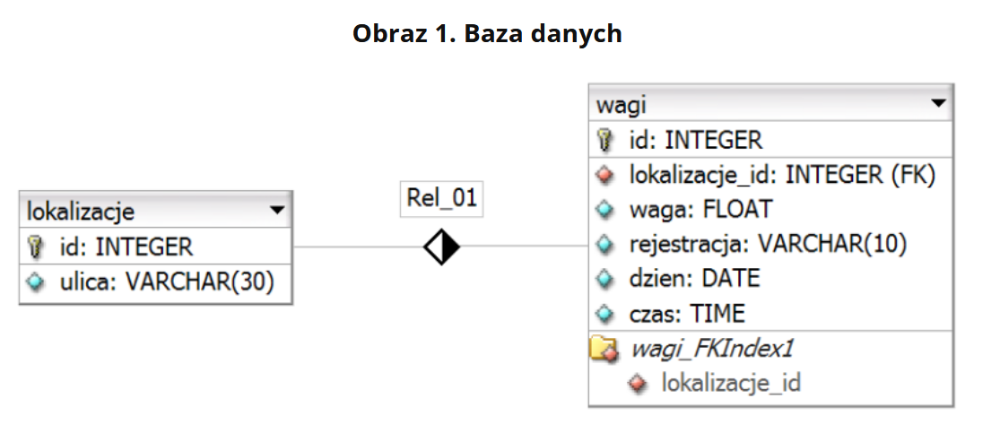
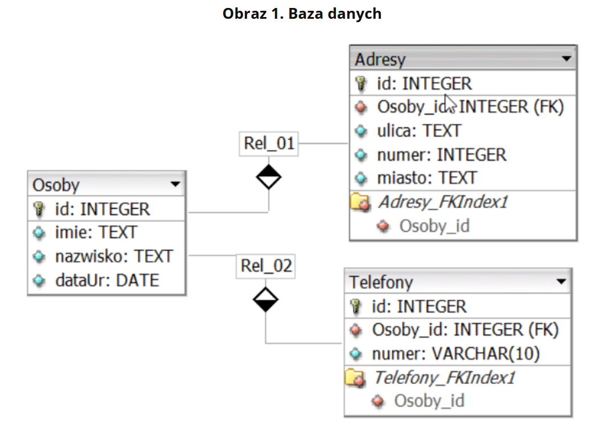
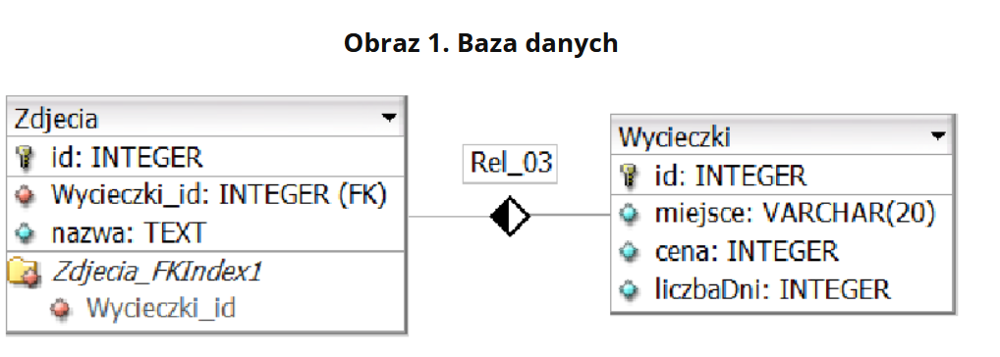

# Wstęp
* Wykonać 3 zadania poniżej.
* zadania spakować do zip lub 7z podpisać imieniem i nazwiskiem 
* dostarczyć przez teams lub przez e-mail na adres ```mateusz.marciniuk@zspm.edu.pl``` temat ma być zgodny z wzorem ```Imie Nazwisko Klasa [zadanie1][EGZAMIN]```

# Zadanie 1
PlikiCz202407 zabezpieczone hasłem: %WAg@Poj@zdoW
## Operacje na bazie danych

Baza danych jest zgodna ze strukturą przedstawioną na Obrazie 1. Tabele są połączone relacją 1..n. Pole waga przechowuje wartości wagi w tonach na jedną oś pojazdu. <br>
Obraz 1. Baza danych <br>
 <br>
W Tabeli 2 umieszczono wybrane funkcje czasu i daty dla bazy danych MariaDB. Za pomocą narzędzia phpMyAdmin wykonaj operacje na bazie danych:

* Utwórz bazę danych o nazwie wazenietirow, z zestawem polskich znaków (np. utf8_unicode_ci)
* Do bazy zaimportuj tabele z pliku baza.sql z rozpakowanego archiwum
* Wykonaj zrzut ekranu po imporcie. Zrzut zapisz w formacie PNG i nazwij import. Nie kadruj zrzutu. Powinien on obejmować cały ekran monitora, z widocznym paskiem zadań. Na zrzucie powinny być widoczne elementy wskazujące na poprawnie wykonany import tabel.
* Wykonaj zapytania SQL działające na bazie wazenietirow. Zapytania zapisz w pliku kwerendy.txt. Wykonaj zrzuty ekranu przedstawiające wyniki działania kwerend. Zrzuty zapisz w formacie JPEG i nadaj im nazwy kw1, kw2, kw3, kw4. Zrzuty powinny obejmować cały ekran monitora z widocznym paskiem zadań.
    * Zapytanie 1: aktualizujące tabelę wagi. Rekordy, w których pole lokalizacje_id jest równe: 2, 3, 4 mają zmienione datę i czas na wartości aktualne. Zapytanie ma charakter uniwersalny, zawsze zmienia wartość na aktualną datę / czas
    * Zapytanie 2: wybierające jedynie ulicę z tabeli lokalizacje
    * Zapytanie 3: wstawiające do tabeli wagi rekord z danymi: lokalizacje_id: 5, waga: losowa liczba z przedziału 1..10 (wygenerowana funkcją), rejestracja: DW12345, aktualna data (do pola dzien) i aktualny czas (do pola czas). Klucz główny nadawany automatycznie. Zapytanie ma charakter uniwersalny, zawsze wstawia wartość aktualnej daty i czasu
    * Zapytanie 4: wybierające jedynie pola rejestracja, waga, dzien, czas z tabeli wagi i odpowiadające mu pole ulica z tabeli lokalizacje dla pojazdów, których waga na oś przekracza 5 t. Należy posłużyć się relacją

# Zadanie 2
PlikiCz202408 zabezpieczone hasłem: ```_Rejestr@cja_```

## Operacje na bazie danych

Baza danych jest zgodna ze strukturą przedstawioną na Obrazie 1. Jedna osoba może mieć zdefiniowane kilka adresów i kilka telefonów. <br>
Obraz 1. Baza danych <br>
 <br>

Za pomocą narzędzia phpMyAdmin wykonaj operacje na bazie danych:

* Utwórz bazę danych o nazwie klienci, z zestawem polskich znaków (np. utf8_unicode_ci)
* Do bazy zaimportuj tabele z pliku baza.sql z rozpakowanego archiwum
* Wykonaj zrzut ekranu po imporcie. Zrzut zapisz w formacie PNG i nazwij import. Nie kadruj zrzutu. Powinien on obejmować cały ekran monitora, z widocznym paskiem zadań. Na zrzucie powinny być widoczne elementy wskazujące na poprawnie wykonany import tabel.
* Wykonaj zapytania SQL działające na bazie klienci. Zapytania zapisz w pliku kwerendy.txt. Wykonaj zrzuty ekranu przedstawiające wyniki działania kwerend. Zrzuty zapisz w formacie JPEG i nadaj im nazwy kw1, kw2, kw3, kw4. Zrzuty powinny obejmować cały ekran monitora z widocznym paskiem zadań.
    * Zapytanie 1: wybierające jedynie imiona i nazwiska osób urodzonych po 2000 roku
    * Zapytanie 2: wybierające nazwy miast, z których pochodzą klienci posortowane alfabetycznie rosnąco. Nazwy miast nie mogą się powtarzać
    * Zapytanie 3: wybierające jedynie imiona i nazwiska osób oraz odpowiadające im numery telefonów. Należy posłużyć się relacją
    * Zapytanie 4: Dodające kolumnę numerMieszkania typu całkowitego, do tabeli Adresy po kolumnie numer

# Zadanie 3
PlikiCz202409 zabezpieczone hasłem: G@leri@Animowan@

## Operacje na bazie danych

Baza danych jest zgodna ze strukturą przedstawioną na Obrazie 1. <br>
Obraz 1. Baza danych <br>
 <br>

Za pomocą narzędzia phpMyAdmin wykonaj operacje na bazie danych:

* Utwórz bazę danych o nazwie wycieczki, z zestawem polskich znaków (np. utf8_unicode_ci)
* Do bazy zaimportuj tabele z pliku wycieczki.sql z rozpakowanego archiwum
* Wykonaj zrzut ekranu po imporcie. Zrzut zapisz w formacie PNG i nazwij import. Nie kadruj zrzutu. Powinien on obejmować cały ekran monitora, z widocznym paskiem zadań. Na zrzucie powinny być widoczne elementy wskazujące na poprawnie wykonany import tabel.
* Wykonaj zapytania SQL działające na bazie wycieczki. Zapytania zapisz w pliku kwerendy.txt. Wykonaj zrzuty ekranu przedstawiające wyniki działania kwerend. Zrzuty zapisz w formacie JPEG i nadaj im nazwy kw1, kw2, kw3, kw4. Zrzuty powinny obejmować cały ekran monitora z widocznym paskiem zadań.
    * Zapytanie 1: wybierające jedynie miejsce i liczbę dni dla wycieczek, których cena jest mniejsza od 1000 zł
    * Zapytanie 2: liczące średnią cenę dla wycieczek pogrupowanych ze względu na liczbę dni (czyli średnia cena wycieczek jednodniowych, dwudniowych itd.). Kwerenda wybiera jedynie liczbę dni oraz średnią cenę, której kolumnę należy nazwać (alias) "sredniaCena"
    * Zapytanie 3: wybierające jedynie miejsce wycieczki i odpowiadającą mu nazwę zdjęcia dla wycieczek, których cena jest wyższa od 500 zł. Należy posłużyć się relacją
    * Zapytanie 4: Tworzące użytkownika Ewa o haśle Ewa!Ewa dla bazy wycieczki na serwerze localhost

