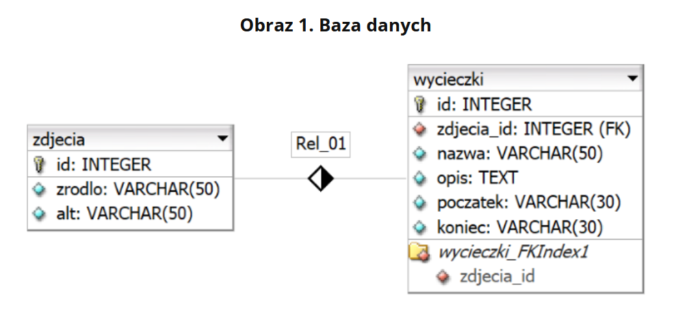
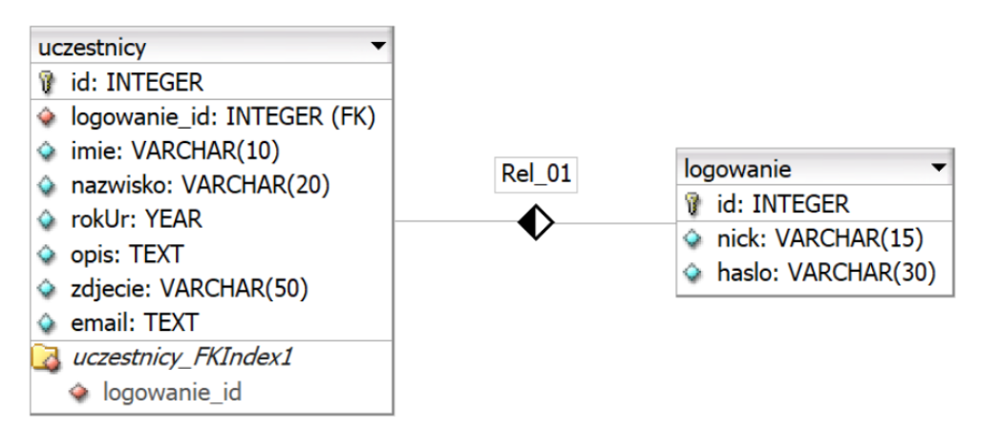
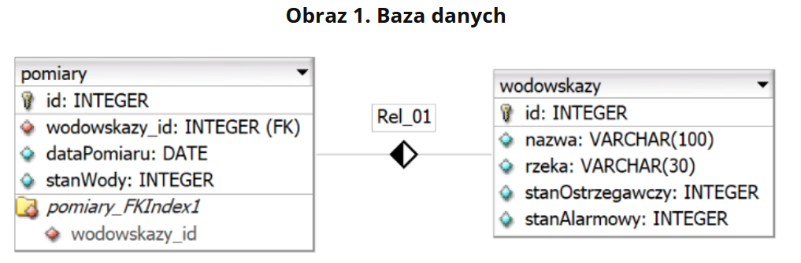

# Zadania należy podpisać numerem zadania imieniem i nazwiskiem i spakować do zip lub 7z następnie wysłać na teams albo mailowo

# Zadanie 1
ZIP o nazwie PlikiCz202401 zabezpieczone hasłem: ^moTocyKle^

## Operacje na bazie danych

Baza danych jest zgodna ze strukturą przedstawioną na Obrazie 1. Tabele są połączone relacją 1..n.

Za pomocą narzędzia phpMyAdmin wykonaj operacje na bazie danych:

* Utwórz bazę danych o nazwie motory, z zestawem polskich znaków (np. utf8_unicode_ci)
* Do bazy zaimportuj tabele z pliku baza.sql z rozpakowanego archiwum
* Wykonaj zrzut ekranu po imporcie. Zrzut zapisz w formacie PNG i nazwij import. Nie kadruj zrzutu. Powinien on obejmować cały ekran monitora, z widocznym paskiem zadań. Na zrzucie powinny być widoczne elementy wskazujące na poprawnie wykonany import tabel.
* Wykonaj zapytania SQL działające na bazie motory. Zapytania zapisz w pliku kwerendy.txt. Wykonaj zrzuty ekranu przedstawiające wyniki działania kwerend. Zrzuty zapisz w formacie JPEG i nadaj im nazwy kw1, kw2, kw3, kw4. Zrzuty powinny obejmować cały ekran monitora z widocznym paskiem zadań.
    * Zapytanie 1: wybierające jedynie nazwy wycieczek, których początek jest w Muszynie, Wieliczce
    * Zapytanie 2: wybierające jedynie pola nazwa, opis i poczatek z tabeli wycieczki oraz odpowiadające im pole zrodlo z tabeli zdjecia. Należy posłużyć się relacją
    * Zapytanie 3: zliczające liczbę wycieczek wpisanych do tabeli wycieczki
    * Zapytanie 4: modyfikujące strukturę tabeli wycieczki, poprzez dodanie kolumny ocena typu całkowitego

# Zadanie 2
ZIP o nazwie PlikiCz202402 zabezpieczone hasłem: ChaT_Ch@t

## Operacje na bazie danych

Baza danych jest zgodna ze strukturą przedstawioną na Obrazie 1.
Obraz 1. Baza danych

Za pomocą narzędzia phpMyAdmin wykonaj operacje na bazie danych:

* Utwórz bazę danych o nazwie chat, z zestawem polskich znaków (np. utf8_unicode_ci)
* Do bazy zaimportuj tabele z pliku baza.sql z rozpakowanego archiwum
* Wykonaj zrzut ekranu po imporcie. Zrzut zapisz w formacie PNG i nazwij import. Nie kadruj zrzutu. Powinien on obejmować cały ekran monitora, z widocznym paskiem zadań. Na zrzucie powinny być widoczne elementy wskazujące na poprawnie wykonany import tabel.
* Wykonaj zapytania SQL działające na bazie chat. Zapytania zapisz w pliku kwerendy.txt. Wykonaj zrzuty ekranu przedstawiające wyniki działania kwerend. Zrzuty zapisz w formacie JPEG i nadaj im nazwy kw1, kw2, kw3, kw4, kw5. Zrzuty powinny obejmować cały ekran monitora z widocznym paskiem zadań.
    * Zapytanie 1: wstawiające do tabeli logowanie nick „Jeremi” z hasłem „Jer123”. Wstawianemu wierszowi należy nadać identyfikator, odpowiadający wartości klucza obcego dla wiersza z danymi „Jeremi Kowalski” z tabeli uczestnicy
    * Zapytanie 2: obliczające średni rok urodzenia uczestników. Wybrana kolumna powinna mieć nazwę (alias) „Średni rok urodzenia”, a obliczony wynik powinien być zaokrąglony w dół do liczby całkowitej
    * Zapytanie 3: wybierające jedynie imię i nazwisko uczestnika oraz odpowiadające mu nick i hasło dla imion rozpoczynających się literą J. Należy posłużyć się relacją
    * Zapytanie 4: tworzące użytkownika uczestnik na localhost z hasłem Ucz123&
    * Zapytanie 5: nadające utworzonemu użytkownikowi prawa do wybierania i aktualizacji danych jedynie dla tabeli uczestnicy

# Zadanie 3
 ZIP o nazwie PlikiCz202403 zabezpieczone hasłem: St@ny%RzeK

## Operacje na bazie danych

Baza danych jest zgodna ze strukturą przedstawioną na Obrazie 1. Tabele są połączone relacją 1..n.
Obraz 1. Baza danych

Za pomocą narzędzia phpMyAdmin wykonaj operacje na bazie danych:

* Utwórz bazę danych o nazwie rzeki, z zestawem polskich znaków (np. utf8_unicode_ci)
* Do bazy zaimportuj tabele z pliku baza.sql z rozpakowanego archiwum
* Wykonaj zrzut ekranu po imporcie. Zrzut zapisz w formacie PNG i nazwij import. Nie kadruj zrzutu. Powinien on obejmować cały ekran monitora, z widocznym paskiem zadań. Na zrzucie powinny być widoczne elementy wskazujące na poprawnie wykonany import tabel.
* Wykonaj zapytania SQL działające na bazie rzeki. Zapytania zapisz w pliku kwerendy.txt. Wykonaj zrzuty ekranu przedstawiające wyniki działania kwerend. Zrzuty zapisz w formacie JPEG i nadaj im nazwy kw1, kw2, kw3, kw4. Zrzuty powinny obejmować cały ekran monitora z widocznym paskiem zadań.
    * Zapytanie 1: wybierające jedynie pola nazwa, rzeka, stanAlarmowy z tabeli wodowskazy
    * Zapytanie 2: wybierające jedynie pola nazwa, rzeka, stanOstrzegawczy, stanAlarmowy z tabeli wodowskazy oraz odpowiadające im pole stanWody z tabeli pomiary dla daty pomiaru 2022-05-05. Należy posłużyć się relacją
    * Zapytanie 3: wybierające jedynie pola nazwa, rzeka, stanOstrzegawczy, stanAlarmowy z tabeli wodowskazy oraz odpowiadające im pole stanWody z tabeli pomiary dla daty pomiaru 2022-05-05 oraz takie, dla których stanWody jest wyższy niż stanOstrzegawczy. Należy posłużyć się relacją
    * Zapytanie 4: wybierające jedynie datę pomiaru oraz liczące średnie stany wody z tabeli pomiary grupując je według daty pomiaru
