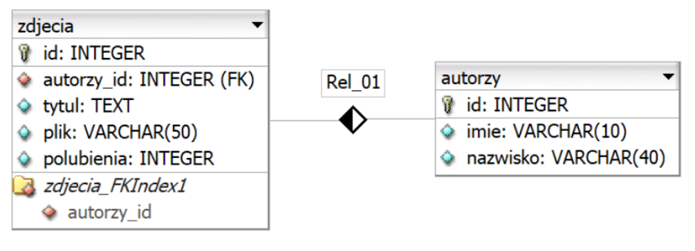
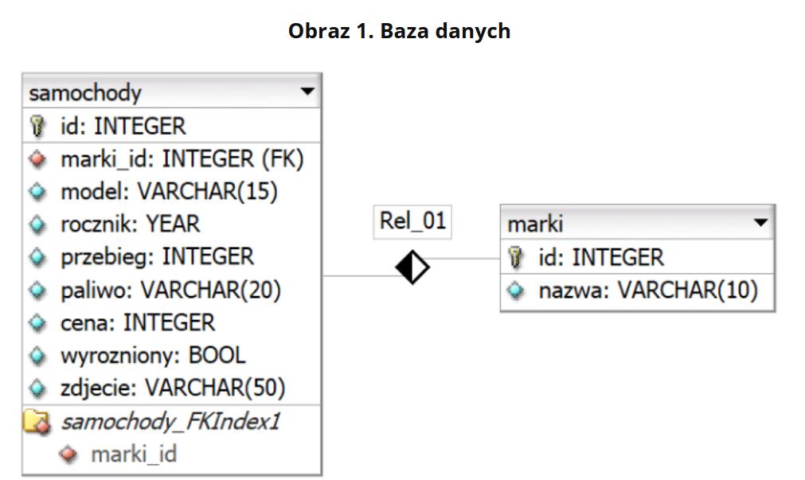
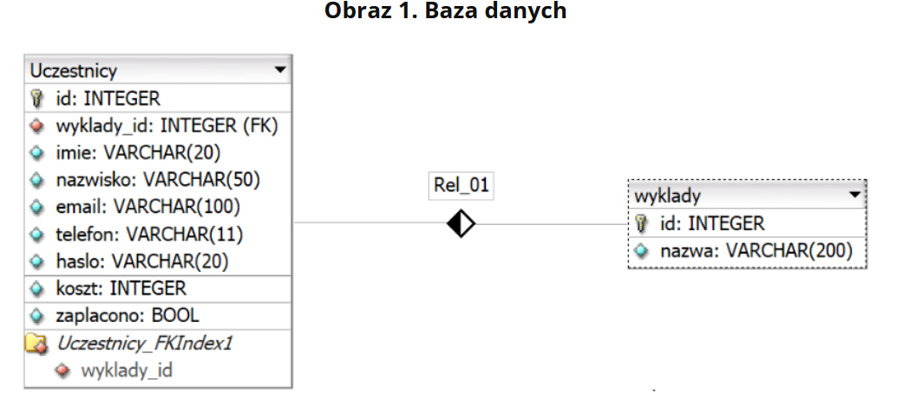

#

# Zadanie 1
ZIP o nazwie PlikiCz202404 zabezpieczone hasłem: (G@LeriA)

Operacje na bazie danych

Baza danych jest zgodna ze strukturą przedstawioną na Obrazie 1. Tabele są połączone relacją 1..n.
Obraz 1. Baza danych

Za pomocą narzędzia phpMyAdmin wykonaj operacje na bazie danych:

* Utwórz bazę danych o nazwie galeria, z zestawem polskich znaków (np. utf8_unicode_ci)
* Do bazy zaimportuj tabele z pliku baza.sql z rozpakowanego archiwum
* Wykonaj zrzut ekranu po imporcie. Zrzut zapisz w formacie PNG i nazwij import. Nie kadruj zrzutu. Powinien on obejmować cały ekran monitora, z widocznym paskiem zadań. Na zrzucie powinny być widoczne elementy wskazujące na poprawnie wykonany import tabel.
* Wykonaj zapytania SQL działające na bazie galeria. Zapytania zapisz w pliku kwerendy.txt. Wykonaj zrzuty ekranu przedstawiające wyniki działania kwerend. Zrzuty zapisz w formacie JPEG i nadaj im nazwy kw1, kw2, kw3, kw4. Zrzuty powinny obejmować cały ekran monitora z widocznym paskiem zadań.
    * Zapytanie 1: wybierające jedynie pola tytul i plik z tabeli zdjecia dla zdjęć z polubieniami większymi lub równymi 100
    * Zapytanie 2: wybierające jedynie pola plik, tytul, polubienia z tabeli zdjecia oraz odpowiadające im pola imie i nazwisko z tabeli autorzy posortowane rosnąco według nazwiska. Należy posłużyć się relacją
    * Zapytanie 3: wybierające jedynie pole imie oraz liczące ile jest zdjęć dla tego imienia. Należy posłużyć się relacją
    * Zapytanie 4: modyfikujące strukturę tabeli zdjecia. Dodana jest kolumna rozmiarPliku typu całkowitego

# Zadanie 2
ZIP o nazwie PlikiCz202405 zabezpieczone hasłem: S@moCHody^

## Operacje na bazie danych

Baza danych jest zgodna ze strukturą przedstawioną na Obrazie 1. Tabele są połączone relacją 1..n. Pole wyrozniony w bazie MySQL jest reprezentowane typem TINYINT(1) i przyjmuje wartość 1, gdy samochód jest wyróżniony oraz 0 w przeciwnym przypadku.
Obraz 1. Baza danych

Za pomocą narzędzia phpMyAdmin wykonaj operacje na bazie danych:

* Utwórz bazę danych o nazwie kupauto, z zestawem polskich znaków (np. utf8_unicode_ci)
* Do bazy zaimportuj tabele z pliku baza.sql z rozpakowanego archiwum
* Wykonaj zrzut ekranu po imporcie. Zrzut zapisz w formacie PNG i nazwij import. Nie kadruj zrzutu. Powinien on obejmować cały ekran monitora, z widocznym paskiem zadań. Na zrzucie powinny być widoczne elementy wskazujące na poprawnie wykonany import tabel.
* Wykonaj zapytania SQL działające na bazie kupauto. Zapytania zapisz w pliku kwerendy.txt. Wykonaj zrzuty ekranu przedstawiające wyniki działania kwerend. Zrzuty zapisz w formacie JPEG i nadaj im nazwy kw1, kw2, kw3, kw4. Zrzuty powinny obejmować cały ekran monitora z widocznym paskiem zadań.
    * Zapytanie 1: wybierające jedynie nazwy marek samochodów
    * Zapytanie 2: wybierające jedynie pola: model, rocznik, przebieg, paliwo, cena, zdjecie dla samochodu o id równym 10
    * Zapytanie 3: wybierające jedynie pole nazwa z tabeli marki i odpowiadające jej pola: model, rocznik, cena, zdjecie z tabeli samochody jedynie dla samochodów wyróżnionych. Zapytanie wybiera dokładnie 4 wiersze. Należy posłużyć się relacją
    * Zapytanie 4: wybierające jedynie pola: model, cena, zdjecie z tabeli samochody dla samochodów o nazwie marki Audi. Należy posłużyć się relacją

# Zadanie 3
ZIP o nazwie PlikiCz202406 zabezpieczone hasłem: ^konfErEncja&

Operacje na bazie danych

Baza danych jest zgodna ze strukturą przedstawioną na Obrazie 1. Pole zaplacono w bazie danych jest reprezentowane jako typ TINYINT(1) i przyjmuje wartość 1, gdy uczestnik zapłacił za konferencję lub 0 w przeciwnym przypadku
Obraz 1. Baza danych

Za pomocą narzędzia phpMyAdmin wykonaj operacje na bazie danych:

* Utwórz bazę danych o nazwie konferencja, z zestawem polskich znaków (np. utf8_unicode_ci)
* Do bazy zaimportuj tabele z pliku baza.sql z rozpakowanego archiwum
* Wykonaj zrzut ekranu po imporcie. Zrzut zapisz w formacie PNG i nazwij import. Nie kadruj zrzutu. Powinien on obejmować cały ekran monitora, z widocznym paskiem zadań. Na zrzucie powinny być widoczne elementy wskazujące na poprawnie wykonany import tabel.
* Wykonaj zapytania SQL działające na bazie konferencja. Zapytania zapisz w pliku kwerendy.txt. Wykonaj zrzuty ekranu przedstawiające wyniki działania kwerend. Zrzuty zapisz w formacie JPEG i nadaj im nazwy kw1, kw2, kw3, kw4. Zrzuty powinny obejmować cały ekran monitora z widocznym paskiem zadań.
    * Zapytanie 1: wybierające jedynie imię, nazwisko i koszt konferencji dla uczestników, którzy jeszcze nie zapłacili za konferencję
    * Zapytanie 2: liczące dla wszystkich uczestników: średni koszt konferencji z nazwą kolumny (alias) „Średni koszt”, sumę kosztów z nazwą kolumny (alias) „Całkowity koszt”, liczbę zapisanych w bazie uczestników z nazwą kolumny (alias) „Liczba uczestników”
    * Zapytanie 3: wybierające jedynie nazwę wykładu i przypisane jej nazwiska i e-maile uczestników, dla tych uczestników, którzy zapłacili za konferencję. Należy posłużyć się relacją
    * Zapytanie 4: usuwające kolumnę z hasłem uczestnika
