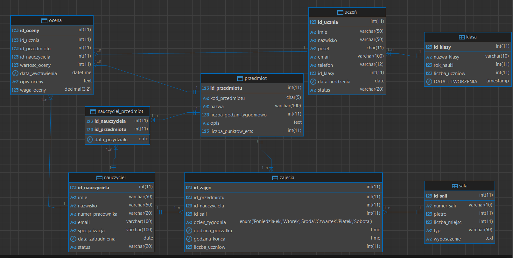

# PROJEKTOWANIE BAZ DANYCH DLA APLIKACJI SZKOLNEJ
## Lekcja: Metodologia i Podejście do Projektowania

---

## STRESZCZENIE LEKCJI

**Cel lekcji:** Nauczenie się systematycznego podejścia do projektowania bazy danych dla rzeczywistej aplikacji na przykładzie systemu zarządzania szkołą.

**Czas trwania:** 90 minut

**Narzędzia:** MySQL, MySQL Workbench (lub diagram textowy)

**Efekty uczenia się:**
- Zrozumienie faz projektowania bazy danych
- Opanowanie metody od analizy wymagań do implementacji
- Praktyczne umiejętności tworzenia diagramów ER
- Normalizacja danych w praktyce

---

## 1. WPROWADZENIE - CO TO JEST METODOLOGIA PROJEKTOWANIA?

### 1.1 Dlaczego metodologia jest ważna?

Projektowanie bazy danych bez planu to jak budowanie domu bez projektu:
- ❌ Problemy z wydajnością
- ❌ Redundancja danych
- ❌ Trudne modyfikacje w przyszłości
- ❌ Błędy w logice biznesowej

✅ **Prawidłowe podejście** = Solidna podstawa dla całej aplikacji

### 1.2 Fazy projektowania bazy danych

```
┌─────────────────────────────────────────────────────────┐
│  1. ANALIZA WYMAGAŃ                                     │
│     (Czego aplikacja potrzebuje?)                       │
└──────────────┬──────────────────────────────────────────┘
               ↓
┌─────────────────────────────────────────────────────────┐
│  2. MODELOWANIE KONCEPTUALNE                            │
│     (Jakie są encje i relacje?)                         │
└──────────────┬──────────────────────────────────────────┘
               ↓
┌─────────────────────────────────────────────────────────┐
│  3. PROJEKTOWANIE LOGICZNE                              │
│     (Jak zorganizować tabele?)                          │
└──────────────┬──────────────────────────────────────────┘
               ↓
┌─────────────────────────────────────────────────────────┐
│  4. NORMALIZACJA DANYCH                                 │
│     (Wyeliminuj redundancję)                            │
└──────────────┬──────────────────────────────────────────┘
               ↓
┌─────────────────────────────────────────────────────────┐
│  5. PROJEKTOWANIE FIZYCZNE                              │
│     (Typy danych, indeksy, ograniczenia)                │
└──────────────┬──────────────────────────────────────────┘
               ↓
┌─────────────────────────────────────────────────────────┐
│  6. IMPLEMENTACJA I TESTOWANIE                          │
│     (Tworzenie i weryfikacja)                           │
└─────────────────────────────────────────────────────────┘
```

---

## 2. FAZA 1: ANALIZA WYMAGAŃ

### 2.1 Zdefiniowanie kontekstu biznesowego

**Pytania do zadania sobie:**
- Jaka jest główna funkcja aplikacji?
- Kto będzie używać aplikację?
- Jakie procesy musi wspierać?
- Jakie informacje musimy przechowywać?

### 2.2 Przykład: System Zarządzania Szkołą

**Opis:** Aplikacja do zarządzania szkołą obsługująca uczniów, nauczycieli, przedmioty, oceny i sale lekcyjne.

**Główne funkcje:**
1. Rejestracja uczniów i nauczycieli
2. Zarządzanie przedmiotami
3. Przydzielanie nauczycieli do przedmiotów
4. Tworzenie rozkładu zajęć (sale + godziny)
5. Wprowadzanie ocen dla uczniów
6. Generowanie raportów (średnie ocen, frekwencja)

### 2.3 Zbieranie danych - Arkusz wymagań

| Encja | Co musimy wiedzieć? | Przykładowe atrybuty |
|-------|-------------------|----------------------|
| **UCZEŃ** | Tożsamość, klasa, kontakt | Imię, Nazwisko, PESEL, Klasa, Email, Telefon |
| **NAUCZYCIEL** | Tożsamość, specjalizacja | Imię, Nazwisko, Numer pracownika, Specjalizacja |
| **PRZEDMIOT** | Nazwa, kod | Kod, Nazwa, Liczba godzin/tydzień |
| **OCENA** | Kto, co, jaka ocena, kiedy | Student, Przedmiot, Wartość, Data, Nauczyciel |
| **SALA** | Identyfikacja, pojemność | Numer, Piętro, Liczba miejsc |
| **ZAJĘCIA** | Harmonogram | Przedmiot, Nauczyciel, Sala, Dzień, Godzina |

---

## 3. FAZA 2: MODELOWANIE KONCEPTUALNE

### 3.1 Diagram ER (Entity-Relationship)

Diagram ER pokazuje:
- **Encje** (obiekty, które przechowujemy)
- **Atrybuty** (właściwości encji)
- **Relacje** (powiązania między encjami)

### 3.2 Analiza relacji w naszym systemie

#### UCZEŃ - KLASA (1:N)
- Jeden uczeń należy do **jednej** klasy
- Jedna klasa ma **wiele** uczniów
```
KLASA (1) ──────── (N) UCZEŃ
```

#### NAUCZYCIEL - PRZEDMIOT (N:M)
- Jeden nauczyciel uczy **wiele** przedmiotów
- Jeden przedmiot uczy **wielu** nauczycieli
```
NAUCZYCIEL (N) ────── (M) PRZEDMIOT
```
*Potrzebna tabela asocjacyjna: NAUCZYCIEL_PRZEDMIOT*

#### UCZEŃ - PRZEDMIOT - OCENA (N:M)
- Jeden uczeń ma oceny z **wielu** przedmiotów
- Jeden przedmiot ma oceny **wielu** uczniów
- Każda kombinacja: jeden uczeń + jeden przedmiot = **wiele** ocen (różne daty)
```
UCZEŃ (N) ────── (M) PRZEDMIOT
    ↑                   ↑
    └─── OCENA ────────┘
```

#### ZAJĘCIA - SALA - NAUCZYCIEL - PRZEDMIOT
```
PRZEDMIOT → ZAJĘCIA ← SALA
            ↑
         NAUCZYCIEL
```

### 3.3 Graficzna reprezentacja


```
ZAJĘCIA
├─ id_zajęc (PK)
├─ id_przedmiotu (FK)
├─ id_nauczyciela (FK)
├─ id_sali (FK)
├─ dzien_tygodnia
├─ godzina_poczatku
└─ godzina_konca
```

---

## 4. FAZA 3: PROJEKTOWANIE LOGICZNE

### 4.1 Konwertowanie diagramu na tabele

Z diagramu ER wyciągamy tabelę dla każdej encji i każdej relacji N:M.

**Reguły:**
1. Każda encja = 1 tabela
2. Każdy atrybut encji = kolumna w tabeli
3. Klucz główny (PK) = unikalny identyfikator
4. Klucz obcy (FK) = odniesienie do innej tabeli
5. Relacja N:M = tabela asocjacyjna (łącznikowa)

### 4.2 Lista tabel do utworzenia

```
1. KLASA
2. UCZEŃ
3. NAUCZYCIEL
4. PRZEDMIOT
5. NAUCZYCIEL_PRZEDMIOT (N:M)
6. SALA
7. ZAJĘCIA
8. OCENA
```

---

## 5. FAZA 4: NORMALIZACJA DANYCH

### 5.1 Co to jest normalizacja?

Normalizacja to proces wyeliminowania redundancji i anomalii danych. Zgodnie z **normami postaciowymi (NF - Normal Forms)**.

### 5.2 Pierwsza postać normalna (1NF)

**Reguła:** Każda komórka musi zawierać tylko jedną wartość (atomową).

❌ **ZŁE:**
```
Tabela: UCZEŃ_PRZEDMIOTY
┌──────────────┬────────────────────────────────────┐
│ id_ucznia    │ przedmioty                         │
├──────────────┼────────────────────────────────────┤
│ 1            │ Matematyka, Fizyka, Historia       │
│ 2            │ Historia, Chemia                   │
└──────────────┴────────────────────────────────────┘
```
Problem: Przedmioty są listą, nie wartością atomową!

✅ **DOBRZE (1NF):**
```
Tabela: UCZEŃ
┌──────────────┬────────────┐
│ id_ucznia    │ imie       │
├──────────────┼────────────┤
│ 1            │ Jan        │
│ 2            │ Maria      │
└──────────────┴────────────┘

Tabela: NAUCZYCIEL_PRZEDMIOT (asocjacyjna)
┌──────────────────┬────────────────┐
│ id_nauczyciela   │ id_przedmiotu  │
├──────────────────┼────────────────┤
│ 5                │ 1              │
│ 5                │ 2              │
└──────────────────┴────────────────┘
```

### 5.3 Druga postać normalna (2NF)

**Reguła:** Tabela musi być w 1NF, a każdy atrybut niebędący kluczem powinien zależeć od całego klucza głównego, a nie tylko od jego części.

❌ **ZŁE (2NF naruszenie):**
```
Tabela: ZAJĘCIA_NAUCZYCIEL
┌──────────────┬───────────────┬──────────────────┬──────────────┐
│ id_zajęc(PK) │ id_nauczyciela│ imie_nauczyciela │ id_przedmiotu│
├──────────────┼───────────────┼──────────────────┼──────────────┤
│ 101          │ 5             │ Jan Kowalski     │   1          │
└──────────────┴───────────────┴──────────────────┴──────────────┘

Problem: Imię nauczyciela zależy od id_nauczyciela, nie od całego klucza!
```

✅ **DOBRZE (2NF):**
```
Tabela: NAUCZYCIEL
┌───────────────────┬────────────┐
│ id_nauczyciele(PK)│ imie       │
└───────────────────┴────────────┘

Tabela: ZAJĘCIA
┌──────────────┬───────────────────┬──────────────────┐
│ id_zajęc(PK) │ id_nauczyciela(FK)│ id_przedmiotu(FK)│
└──────────────┴───────────────────┴──────────────────┘

Imię teraz pobieramy przez JOIN z tabeli NAUCZYCIEL
```

### 5.4 Trzecia postać normalna (3NF)

**Reguła:** Tabela musi być w 2NF, a żaden atrybut niebędący kluczem nie powinien zależeć od innego atrybutu niekluczowego, lecz wyłącznie od klucza głównego.

❌ **ZŁE (3NF naruszenie):**
```
Tabela: UCZEŃ
┌──────────────┬────────────┬──────────────┬──────────────────┐
│ id_ucznia(PK)│ imie       │ id_klasy(FK) │ nazwa_klasy      │
├──────────────┼────────────┼──────────────┼──────────────────┤
│ 1            │ Jan        │ 1            │ 1A               │
│ 2            │ Maria      │ 1            │ 1A               │
└──────────────┴────────────┴──────────────┴──────────────────┘

Problem: nazwa_klasy zależy od id_klasy, a nie od id_ucznia!
Redundancja: "1A" powtarza się dla każdego ucznia z tej klasy.
```

✅ **DOBRZE (3NF):**
```
Tabela: KLASA
┌──────────────┬────────────┐
│ id_klasy(PK) │ nazwa_klasy│
├──────────────┼────────────┤
│ 1            │ 1A         │
└──────────────┴────────────┘

Tabela: UCZEŃ
┌──────────────┬────────────┬──────────────┐
│ id_ucznia(PK)│ imie       │ id_klasy(FK) │
├──────────────┼────────────┼──────────────┤
│ 1            │ Jan        │ 1            │
│ 2            │ Maria      │ 1            │
└──────────────┴────────────┴──────────────┘

Nazwa klasy pobieramy przez JOIN, zero redundancji!
```

### 5.5 Pracownia: Sprawdzenie normalizacji

Sprawdzić czy każda tabela w naszym systemie spełnia 3NF:

| Tabela | Encja | Pierwotna struktura | Zmiany | Status |
|--------|-------|-------------------|--------|--------|
| KLASA | Identyfikacja klasy | OK | - | ✓ 3NF |
| UCZEŃ | Dane ucznia + klasa | Usunięta nazwa_klasy | Dodany FK | ✓ 3NF |
| NAUCZYCIEL | Dane nauczyciela | OK | - | ✓ 3NF |
| PRZEDMIOT | Dane przedmiotu | OK | - | ✓ 3NF |
| NAUCZYCIEL_PRZEDMIOT | Relacja N:M | Tylko klucze | - | ✓ 3NF |
| SALA | Dane sali | OK | - | ✓ 3NF |
| ZAJĘCIA | Harmonogram | Tylko klucze + godziny | - | ✓ 3NF |
| OCENA | Ocena ucznia | Usunięte redundantne dane | Tylko klucze + wartość | ✓ 3NF |

---

## 6. FAZA 5: PROJEKTOWANIE FIZYCZNE - DEFINICJA TABEL

### 6.1 Wybór typów danych MySQL

| Typ | Opis | Przykład zastosowania |
|-----|------|----------------------|
| INT | Liczby całkowite | ID, liczba uczniów |
| VARCHAR(n) | Tekst o zmiennej długości | Imiona, nazwiska |
| CHAR(n) | Tekst stały | Kody (np. kod_przedmiotu) |
| DATE | Data | Data urodzenia, data oceny |
| DECIMAL(10,2) | Liczby dziesiętne | Średnia ocen |
| BOOLEAN / TINYINT(1) | Prawda/Fałsz | Czy uczestniczy |
| TEXT | Duży tekst | Uwagi, notatki |

### 6.2 Ograniczenia (Constraints)

| Ograniczenie | Opis | Przykład |
|--------------|------|---------|
| PRIMARY KEY | Unikalny identyfikator wiersza | id_ucznia |
| FOREIGN KEY | Odniesienie do innej tabeli | id_klasy w UCZEŃ |
| UNIQUE | Wartość musi być unikalna | email, PESEL |
| NOT NULL | Pole nie może być puste | imie, nazwisko |
| DEFAULT | Wartość domyślna | typ_sali = 'zwykła' |
| CHECK | Warunki logiczne | wartosc_oceny BETWEEN 1 AND 6 |

### 6.3 Definicje tabel MySQL

```sql
-- 1. TABELA: KLASA
CREATE TABLE KLASA (
    id_klasy INT PRIMARY KEY AUTO_INCREMENT,
    nazwa_klasy VARCHAR(10) NOT NULL UNIQUE,
    rok_nauki INT NOT NULL CHECK (rok_nauki IN (1, 2, 3, 4)),
    liczba_uczniow INT DEFAULT 0,
    DATA_UTWORZENIA TIMESTAMP DEFAULT CURRENT_TIMESTAMP
);

-- 2. TABELA: UCZEŃ
CREATE TABLE UCZEŃ (
    id_ucznia INT PRIMARY KEY AUTO_INCREMENT,
    imie VARCHAR(50) NOT NULL,
    nazwisko VARCHAR(50) NOT NULL,
    pesel CHAR(11) NOT NULL UNIQUE,
    email VARCHAR(100) UNIQUE,
    telefon VARCHAR(12),
    id_klasy INT NOT NULL,
    data_urodzenia DATE,
    status VARCHAR(20) DEFAULT 'aktywny',
    FOREIGN KEY (id_klasy) REFERENCES KLASA(id_klasy) ON DELETE RESTRICT
);

-- 3. TABELA: NAUCZYCIEL
CREATE TABLE NAUCZYCIEL (
    id_nauczyciela INT PRIMARY KEY AUTO_INCREMENT,
    imie VARCHAR(50) NOT NULL,
    nazwisko VARCHAR(50) NOT NULL,
    numer_pracownika VARCHAR(20) UNIQUE NOT NULL,
    email VARCHAR(100) UNIQUE,
    specjalizacja VARCHAR(100),
    data_zatrudnienia DATE,
    status VARCHAR(20) DEFAULT 'aktywny'
);

-- 4. TABELA: PRZEDMIOT
CREATE TABLE PRZEDMIOT (
    id_przedmiotu INT PRIMARY KEY AUTO_INCREMENT,
    kod_przedmiotu CHAR(5) UNIQUE NOT NULL,
    nazwa VARCHAR(100) NOT NULL,
    liczba_godzin_tygodniowo INT NOT NULL CHECK (liczba_godzin_tygodniowo > 0),
    opis TEXT,
    liczba_punktow_ects INT DEFAULT 0
);

-- 5. TABELA ASOCJACYJNA: NAUCZYCIEL_PRZEDMIOT
CREATE TABLE NAUCZYCIEL_PRZEDMIOT (
    id_nauczyciela INT NOT NULL,
    id_przedmiotu INT NOT NULL,
    data_przydziału DATE DEFAULT CURRENT_DATE,
    PRIMARY KEY (id_nauczyciela, id_przedmiotu),
    FOREIGN KEY (id_nauczyciela) REFERENCES NAUCZYCIEL(id_nauczyciela) ON DELETE CASCADE,
    FOREIGN KEY (id_przedmiotu) REFERENCES PRZEDMIOT(id_przedmiotu) ON DELETE CASCADE
);

-- 6. TABELA: SALA
CREATE TABLE SALA (
    id_sali INT PRIMARY KEY AUTO_INCREMENT,
    numer_sali VARCHAR(10) NOT NULL UNIQUE,
    pietro INT CHECK (pietro >= 0),
    liczba_miejsc INT NOT NULL CHECK (liczba_miejsc > 0),
    typ VARCHAR(50),
    wyposażenie TEXT
);

-- 7. TABELA: ZAJĘCIA
CREATE TABLE ZAJĘCIA (
    id_zajęc INT PRIMARY KEY AUTO_INCREMENT,
    id_przedmiotu INT NOT NULL,
    id_nauczyciela INT NOT NULL,
    id_sali INT NOT NULL,
    dzien_tygodnia ENUM('Poniedziałek','Wtorek','Środa','Czwartek','Piątek','Sobota') NOT NULL,
    godzina_poczatku TIME NOT NULL,
    godzina_konca TIME NOT NULL,
    liczba_uczniow INT DEFAULT 0,
    FOREIGN KEY (id_przedmiotu) REFERENCES PRZEDMIOT(id_przedmiotu) ON DELETE RESTRICT,
    FOREIGN KEY (id_nauczyciela) REFERENCES NAUCZYCIEL(id_nauczyciela) ON DELETE RESTRICT,
    FOREIGN KEY (id_sali) REFERENCES SALA(id_sali) ON DELETE RESTRICT,
    UNIQUE KEY unique_harmonogram (id_sali, dzien_tygodnia, godzina_poczatku)
);

-- 8. TABELA: OCENA
CREATE TABLE OCENA (
    id_oceny INT PRIMARY KEY AUTO_INCREMENT,
    id_ucznia INT NOT NULL,
    id_przedmiotu INT NOT NULL,
    id_nauczyciela INT NOT NULL,
    wartosc_oceny INT NOT NULL CHECK (wartosc_oceny BETWEEN 1 AND 6),
    data_wystawienia DATETIME DEFAULT CURRENT_TIMESTAMP,
    opis_oceny TEXT,
    waga_oceny DECIMAL(3,2) DEFAULT 1.0,
    FOREIGN KEY (id_ucznia) REFERENCES UCZEŃ(id_ucznia) ON DELETE CASCADE,
    FOREIGN KEY (id_przedmiotu) REFERENCES PRZEDMIOT(id_przedmiotu) ON DELETE CASCADE,
    FOREIGN KEY (id_nauczyciela) REFERENCES NAUCZYCIEL(id_nauczyciela) ON DELETE RESTRICT
);

-- INDEKSY dla poprawy wydajności
CREATE INDEX idx_uczeń_klasa ON UCZEŃ(id_klasy);
CREATE INDEX idx_ocena_ucznia ON OCENA(id_ucznia);
CREATE INDEX idx_ocena_przedmiotu ON OCENA(id_przedmiotu);
CREATE INDEX idx_zajęcia_nauczyciela ON ZAJĘCIA(id_nauczyciela);
CREATE INDEX idx_zajęcia_sali ON ZAJĘCIA(id_sali);
```

### 6.4 Wyjaśnienie kluczowych koncepcji

**AUTO_INCREMENT**
- Automatycznie generuje następny numer
- Idealny dla ID

**UNIQUE**
- Gwarantuje, że każda wartość w kolumnie jest unikalna
- PESEL, email - każdy uczeń ma inny

**FOREIGN KEY (FK)**
- Odniesienie do innej tabeli
- Zapobiega błędom (np. przydzielenie ucznia do nieistniejącej klasy)
- `ON DELETE CASCADE` = jeśli usuwamy klasę, usuwane są uczniowie
- `ON DELETE RESTRICT` = nie pozwala usunąć, jeśli istnieją powiązane rekordy

**CONSTRAINT CHECK**
- Sprawdza wartości przed wstawieniem
- `wartosc_oceny BETWEEN 1 AND 6` - tylko oceny 1-6

**UNIQUE KEY na wiele kolumn**
- `UNIQUE KEY unique_harmonogram (id_sali, dzien_tygodnia, godzina_poczatku)`
- W tej samej sali nie mogą się odbywać dwie zajęcia w tym samym czasie

---

## 7. FAZA 6: IMPLEMENTACJA I TESTOWANIE

### 7.1 Tworzenie bazy danych

```sql
CREATE DATABASE SYSTEM_SZKOLNY;
USE SYSTEM_SZKOLNY;

-- Teraz wstawiamy definicje tabel (sekcja 6.3)
```

### 7.2 Testowe dane (INSERT)

```sql
-- Wstaw klasy
INSERT INTO KLASA (nazwa_klasy, rok_nauki) VALUES 
('1A', 1),
('2B', 2),
('3C', 3);

-- Wstaw nauczycieli
INSERT INTO NAUCZYCIEL (imie, nazwisko, numer_pracownika, specjalizacja) VALUES
('Jan', 'Kowalski', 'NP001', 'Matematyka'),
('Maria', 'Nowak', 'NP002', 'Historia'),
('Piotr', 'Lewandowski', 'NP003', 'Informatyka');

-- Wstaw przedmioty
INSERT INTO PRZEDMIOT (kod_przedmiotu, nazwa, liczba_godzin_tygodniowo) VALUES
('MAT01', 'Matematyka', 4),
('HIS01', 'Historia', 3),
('INF01', 'Informatyka', 2);

-- Powiąż nauczycieli z przedmiotami
INSERT INTO NAUCZYCIEL_PRZEDMIOT (id_nauczyciela, id_przedmiotu) VALUES
(1, 1),  -- Jan Kowalski uczy Matematyki
(2, 2),  -- Maria Nowak uczy Historii
(3, 3);  -- Piotr Lewandowski uczy Informatyki

-- Wstaw uczniów
INSERT INTO UCZEŃ (imie, nazwisko, pesel, email, id_klasy) VALUES
('Adam', 'Zaremba', '10123456789', 'adam.z@school.pl', 1),
('Ewa', 'Krupa', '10234567890', 'ewa.k@school.pl', 1),
('Tomasz', 'Błasiński', '10345678901', 'tomasz.b@school.pl', 2);

-- Wstaw sale
INSERT INTO SALA (numer_sali, pietro, liczba_miejsc, typ) VALUES
('101', 1, 30, 'Klasa standardowa'),
('102', 1, 30, 'Klasa standardowa'),
('LAB01', 0, 25, 'Laboratorium informatyki');

-- Wstaw zajęcia
INSERT INTO ZAJĘCIA (id_przedmiotu, id_nauczyciela, id_sali, dzien_tygodnia, godzina_poczatku, godzina_konca) VALUES
(1, 1, 1, 'Poniedziałek', '08:00', '08:45'),
(2, 2, 2, 'Wtorek', '09:00', '09:45'),
(3, 3, 3, 'Środa', '10:00', '10:45');

-- Wstaw oceny
INSERT INTO OCENA (id_ucznia, id_przedmiotu, id_nauczyciela, wartosc_oceny) VALUES
(1, 1, 1, 4),  -- Adam dostał 4 z Matematyki
(1, 2, 2, 5),  -- Adam dostał 5 z Historii
(2, 1, 1, 3),  -- Ewa dostała 3 z Matematyki
(2, 3, 3, 5);  -- Ewa dostała 5 z Informatyki
```

### 7.3 Testy - Zapytania SQL

```sql
-- Test 1: Wyświetl wszystkich uczniów z ich klasami
SELECT u.imie, u.nazwisko, k.nazwa_klasy 
FROM UCZEŃ u 
JOIN KLASA k ON u.id_klasy = k.id_klasy;

-- Test 2: Jakie przedmioty uczy Jan Kowalski?
SELECT DISTINCT p.nazwa 
FROM NAUCZYCIEL n
JOIN NAUCZYCIEL_PRZEDMIOT np ON n.id_nauczyciela = np.id_nauczyciela
JOIN PRZEDMIOT p ON np.id_przedmiotu = p.id_przedmiotu
WHERE n.imie = 'Jan' AND n.nazwisko = 'Kowalski';

-- Test 3: Średnia ocen Adama
SELECT u.imie, u.nazwisko, AVG(o.wartosc_oceny) AS srednia
FROM UCZEŃ u
JOIN OCENA o ON u.id_ucznia = o.id_ucznia
WHERE u.imie = 'Adam'
GROUP BY u.id_ucznia;

-- Test 4: Harmonogram zajęć w poniedziałek
SELECT z.dzien_tygodnia, z.godzina_poczatku, p.nazwa, n.imie, n.nazwisko, s.numer_sali
FROM ZAJĘCIA z
JOIN PRZEDMIOT p ON z.id_przedmiotu = p.id_przedmiotu
JOIN NAUCZYCIEL n ON z.id_nauczyciela = n.id_nauczyciela
JOIN SALA s ON z.id_sali = s.id_sali
WHERE z.dzien_tygodnia = 'Poniedziałek'
ORDER BY z.godzina_poczatku;

-- Test 5: Czy jest konflikt (ta sama sala, ten sam czas)?
SELECT s.numer_sali, z1.dzien_tygodnia, z1.godzina_poczatku, z1.godzina_konca,
       p1.nazwa AS przedmiot1, p2.nazwa AS przedmiot2
FROM ZAJĘCIA z1
JOIN ZAJĘCIA z2 ON z1.id_sali = z2.id_sali 
  AND z1.dzien_tygodnia = z2.dzien_tygodnia
  AND z1.godzina_poczatku < z2.godzina_konca 
  AND z1.godzina_konca > z2.godzina_poczatku
  AND z1.id_zajęc < z2.id_zajęc
JOIN SALA s ON z1.id_sali = s.id_sali
JOIN PRZEDMIOT p1 ON z1.id_przedmiotu = p1.id_przedmiotu
JOIN PRZEDMIOT p2 ON z2.id_przedmiotu = p2.id_przedmiotu;
```

### 7.4 Walidacja i checklist

- [ ] Wszystkie tabele utworzono
- [ ] Wszystkie klucze główne i obce działają
- [ ] Dane testowe wstawione
- [ ] Zapytania SELECT działają
- [ ] Nie ma konfliktów w harmonogramie
- [ ] Brak redundancji danych
- [ ] Indeksy utworzone na popularne kolumny
- [ ] Ograniczenia CHECK działają
- [ ] Kaskadowe usuwanie działa prawidłowo

---

## 8. METODOLOGIA - PODSUMOWANIE PROCESU

### 8.1 Diagram przepływu metodologii

```
START
  ↓
[1] ANALIZA WYMAGAŃ
    └─→ Zdefiniuj domeny biznesu
    └─→ Wymień encje i atrybuty
    └─→ Określ aktorów systemu
  ↓
[2] MODELOWANIE KONCEPTUALNE
    └─→ Narysuj diagram ER
    └─→ Określ relacje (1:1, 1:N, N:M)
    └─→ Zidentyfikuj klucze główne
  ↓
[3] PROJEKTOWANIE LOGICZNE
    └─→ Utwórz tabelę dla każdej encji
    └─→ Utwórz tabele asocjacyjne dla N:M
    └─→ Dodaj klucze obce
  ↓
[4] NORMALIZACJA
    └─→ Sprawdź 1NF (atomowe wartości)
    └─→ Sprawdź 2NF (zależności od klucza)
    └─→ Sprawdź 3NF (brak zależności między atrybutami)
  ↓
[5] PROJEKTOWANIE FIZYCZNE
    └─→ Wybierz typy danych
    └─→ Dodaj ograniczenia (PK, FK, UNIQUE, CHECK)
    └─→ Zdefiniuj indeksy
  ↓
[6] IMPLEMENTACJA I TESTOWANIE
    └─→ Utwórz tabelę w MySQL
    └─→ Wstaw dane testowe
    └─→ Uruchom zapytania walidacyjne
    └─→ Sprawdź ograniczenia
  ↓
[PRZECHODZENIE DO PRODUKCJI]
```

### 8.2 Najczęstsze błędy początkujących

| Błąd | Problem | Rozwiązanie |
|------|---------|------------|
| Brak normalizacji | Redundancja, anomalie | Stosuj 3NF |
| Za mało lub za dużo tabel | Zła struktura | Sprawdzaj diagram ER |
| Brak FK | Sprzeczne dane | Zawsze dodawaj klucze obce |
| Zła kolejność tworzenia tabel | Błędy FK | Tabelę "rodzicielską" najpierw |
| Nie rozpatrywanie relacji N:M | Błędna struktura | Zawsze używaj tabel asocjacyjnych |
| Brak indeksów | Wolne zapytania | Indeksuj kolumny w WHERE i JOIN |
| Niewystarczające ograniczenia | Błędy w danych | Dodawaj CHECK, NOT NULL, UNIQUE |

---

## 9. PRAKTYKA - ZADANIA DLA UCZNIÓW

### 9.1 Zadanie 1: Analiza wymagań (łatwe)

Dany system do zarządzania biblioteką szkolną. Zdefiniuj:
- Jakie są główne encje?
- Jakie atrybuty musi mieć każda encja?
- Jakie są relacje?

**Podpowiedź:** Książki, czytelnicy (uczniowie), wypożyczenia, autorzy

---

### 9.2 Zadanie 2: Diagram ER (średnio)

Narysuj diagram ER dla systemu biblioteki z zadania 1. Uwzględnij:
- Klucze główne
- Relacje (1:1, 1:N, N:M)
- Atrybuty dla każdej encji

---

### 9.3 Zadanie 3: Normalizacja (średnio)

Dane są nieprawidłowe tabele:

```
TABELA: WYPOŻYCZENIE
┌────────────────┬──────────────┬───────────────┬────────────┐
│ id_wypożyczenia│ id_ucznia    │ tituly_książek│ terminy    │
├────────────────┼──────────────┼───────────────┼────────────┤
│ 1              │ 5            │ Harry Potter, │ 2025-12-01 │
│                │              │ Władca Pierśc │ 2025-12-15 │
└────────────────┴──────────────┴───────────────┴────────────┘

TABELA: KSIĄŻKA
┌──────────┬─────────────┬──────────┬──────────────────┐
│ id_książki│ tytul      │ rok_wydania│ imie_autora     │
├──────────┼─────────────┼──────────┼──────────────────┤
│ 1        │ Harry Potter│ 1998     │ Joanne Kathleen  │
└──────────┴─────────────┴──────────┴──────────────────┘
```

**Zadania:**
- Przywróć 1NF (rozbij wiersz z wieloma wartościami)
- Przywróć 2NF (usuń zależności częściowe)
- Przywróć 3NF (usuń zależności przechodnie)

---

### 9.4 Zadanie 4: Projektowanie fizyczne (trudne)

Napisz polecenia CREATE TABLE dla systemu biblioteki, uwzględniając:
- Prawidłowe typy danych
- Klucze główne i obce
- Ograniczenia (UNIQUE, NOT NULL, CHECK)
- Indeksy na popularne kolumny

---

### 9.5 Zadanie 5: Zapytania analityczne (trudne)

Dla bazy danych biblioteki napisz zapytania:

1. Wyświetl wszystkie książki wypożyczone przez ucznia o imieniu "Jan"
2. Wyświetl nauczyciela, który ma najwięcej wypożyczonych książek
3. Wyświetl książki, które są przeterminowane (data zwrotu < dziś)
4. Wyświetl autorów i liczbę ich książek w bibliotece

---

## 10. DLA ZAAWANSOWANYCH - ROZSZERZENIA

### 10.1 Backup i Recovery
```sql
-- Export bazy danych
mysqldump -u root -p SYSTEM_SZKOLNY > backup.sql

-- Import bazy danych
mysql -u root -p SYSTEM_SZKOLNY < backup.sql
```

### 10.2 Transakcje i spójność danych
```sql
START TRANSACTION;

UPDATE KLASA SET liczba_uczniow = liczba_uczniow - 1 WHERE id_klasy = 1;
DELETE FROM UCZEŃ WHERE id_ucznia = 5;

COMMIT;  -- Wszystko się powiedzie lub nic
```

### 10.3 Widoki (Views) - ułatwienie dostępu do danych
```sql
CREATE VIEW SREDNIE_OCENY AS
SELECT 
    u.imie, u.nazwisko, 
    p.nazwa AS przedmiot,
    AVG(o.wartosc_oceny) AS srednia
FROM UCZEŃ u
JOIN OCENA o ON u.id_ucznia = o.id_ucznia
JOIN PRZEDMIOT p ON o.id_przedmiotu = p.id_przedmiotu
GROUP BY u.id_ucznia, p.id_przedmiotu;

-- Teraz wystarczy:
SELECT * FROM SREDNIE_OCENY WHERE srednia > 4;
```

### 10.4 Procedury przechowywane (Stored Procedures)
```sql
DELIMITER //

CREATE PROCEDURE OBLICZ_SREDNIA_UCZNIA(IN p_id_ucznia INT)
BEGIN
    SELECT 
        u.imie, u.nazwisko,
        AVG(o.wartosc_oceny) AS srednia
    FROM UCZEŃ u
    JOIN OCENA o ON u.id_ucznia = o.id_ucznia
    WHERE u.id_ucznia = p_id_ucznia
    GROUP BY u.id_ucznia;
END //

DELIMITER ;

-- Użycie:
CALL OBLICZ_SREDNIA_UCZNIA(1);
```

---

## DODATKI

### Słownikwinamentów
- **Encja** - obiekt z świata rzeczywistego (UCZEŃ, NAUCZYCIEL)
- **Atrybut** - właściwość encji (imie, nazwisko)
- **Relacja** - powiązanie między encjami
- **Klucz główny (PK)** - unikalne ID wiersza
- **Klucz obcy (FK)** - odniesienie do innej tabeli
- **Normalizacja** - usunięcie redundancji i anomalii
- **Redundancja** - powtarzające się dane
- **Anomalia** - błędy spowodowane powtarzającymi się danymi
- **1NF, 2NF, 3NF** - poziomy normalizacji

### Zasoby dodatkowe
- MySQL Documentation: https://dev.mysql.com/doc/
- DB Normalization Guide: Przeczytaj o 3NF
- ER Diagram Tools: Lucidchart, Draw.io, MySQL Workbench
- SQL Practice: LeetCode, HackerRank

---