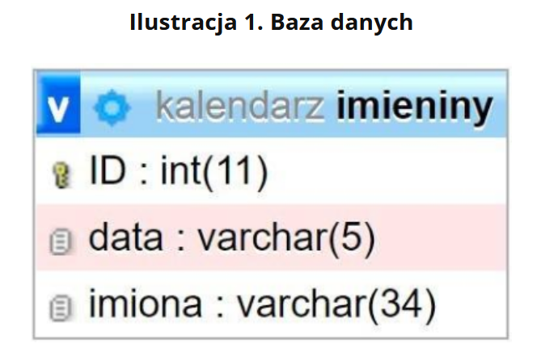
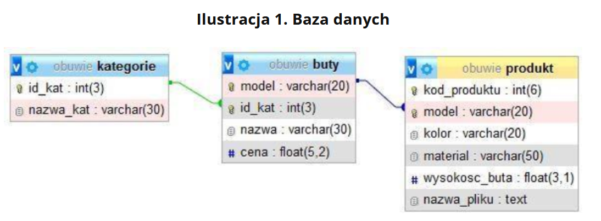

# Zadanie 1 (kalendarz)
```PlikiSt202503 zabezpieczone hasłem: k@L3ndarz``` <br>
Operacje na bazie danych

Baza danych zawiera tabelę imieniny przedstawioną na Ilustracji 1. Data zapisana jest w formacie mm-dd, np. data 7 listopada zapisana jest jako 11-07. <br>
Ilustracja 1. Baza danych <br>


Za pomocą narzędzia phpMyAdmin wykonaj następujące operacje na bazie danych:

* Utwórz bazę danych o nazwie kalendarz, z zestawem polskich znaków (np. utf8_unicode_ci)
* Do utworzonej bazy zaimportuj tabele z pliku baza.sql z rozpakowanego archiwum
* Wykonaj zrzut ekranu po imporcie. Zapisz zrzut w formacie PNG pod nazwą import. Nie kadruj zrzutu. Powinien on obejmować cały ekran monitora, z widocznym paskiem zadań. Na zrzucie powinny być widoczne elementy wskazujące na poprawnie wykonany import tabel
* Wykonaj zapytania SQL działające na bazie kalendarz. Zapytania zapisz w pliku kwerendy.txt. Wykonaj zrzuty ekranu przedstawiające wyniki działania kwerend. Zrzuty zapisz w formacie PNG i nadaj im nazwy kw1, kw2, kw3, kw4. Zrzuty powinny obejmować cały ekran monitora, z widocznym paskiem zadań
    * Zapytanie 1: wybierające z tabeli imieniny jedynie daty, w których są imieniny Karola
    * Zapytanie 2: wybierające jedynie imiona osób, które obchodzą imieniny 4 maja
    * Zapytanie 3: obliczające, ile jest dat, w których imieniny obchodzi osoba, której imię zawiera cząstkę mir (np. Miron, Dobromir, Sędzimira)
    * Zapytanie 4: dodające do tabeli imieniny pole zyczenia typu napisowego, które pomieści 500 znaków
    Wyeksportuj dane z tabeli imieniny do pliku w formacie CSV i nadaj mu nazwę imieniny

# Zadanie 2
```PlikiSt202504 zabezpieczone hasłem: *HurTowni@Buty$``` <br>
Operacje na bazie danych <br>

Do wykonania operacji na bazie należy wykorzystać przedstawione na Ilustracji 1 tabele.
Ilustracja 1. Baza danych <br>


<br>
Za pomocą narzędzia phpMyAdmin wykonaj następujące operacje na bazie danych:

* Utwórz bazę danych o nazwie obuwie, z zestawem polskich znaków (np. utf8_unicode_ci)
* Do utworzonej bazy zaimportuj tabele z pliku obuwie.sql z rozpakowanego archiwum
* Wykonaj zrzut ekranu po imporcie. Zapisz zrzut w formacie JPEG pod nazwą import. Nie kadruj zrzutu. Powinien on obejmować cały ekran monitora, z widocznym paskiem zadań. Na zrzucie powinny być widoczne elementy wskazujące na poprawnie wykonany import tabel
* Wykonaj zapytania SQL działające na bazie obuwie. Zapytania zapisz w pliku kwerendy.txt. Wykonaj zrzuty ekranu przedstawiające wyniki działania kwerend. Zrzuty zapisz w formacie PNG i nadaj im nazwy kw1, kw2, kw3, kw4. Zrzuty powinny obejmować cały ekran monitora, z widocznym paskiem zadań
    * Zapytanie 1: wybierające jedynie pole model z tabeli produkt
    * Zapytanie 2: wybierające jedynie pola model, nazwa, cena z tabeli buty oraz odpowiadające im pole nazwa_pliku z tabeli produkt. Należy posłużyć się relacją
    * Zapytanie 3: wybierające jedynie pola nazwa, cena z tabeli buty i odpowiadające mu pola kolor, kod_produktu, material, nazwa_pliku z tabeli produkt dla modelu „P-59-03”. Należy posłużyć się relacją
    * Zapytanie 4: wstawiające rekord z nazwą kategorii „Sandały” do tabeli kategorie. Klucz główny generowany automatycznie

# Zadanie 3
```PlikiSt202505 zabezpieczone hasłem: SzkoL3Nia%``` <br>
Operacje na bazie danych <br>

Do wykonania operacji na bazie należy wykorzystać przedstawione na Ilustracji 1 tabele. Poszczególne tabele tworzą relacje jeden do wielu zgodnie z obrazem. <br>
Ilustracja 1. Baza danych <br>

<br>
Za pomocą narzędzia phpMyAdmin wykonaj następujące operacje na bazie danych:

* Utwórz bazę danych o nazwie firma, z zestawem polskich znaków (np. utf8_unicode_ci)
* Do utworzonej bazy zaimportuj tabele z pliku firma.sql z rozpakowanego archiwum
* Wykonaj zrzut ekranu po imporcie. Zapisz zrzut w formacie JPEG pod nazwą import. Powinien on obejmować cały ekran monitora, z widocznym paskiem zadań. Na zrzucie powinny być widoczne elementy wskazujące na poprawnie wykonany import tabel
* Wykonaj zapytania SQL działające na bazie firma. Zapytania zapisz w pliku kwerendy.txt. Wykonaj zrzuty ekranu przedstawiające wyniki działania kwerend. Zrzuty zapisz w formacie PNG i nadaj im nazwy kw1, kw2, kw3, kw4. Zrzuty powinny obejmować cały ekran monitora, z widocznym paskiem zadań
    * Zapytanie 1: wybierające jedynie daty i tematy szkoleń posortowane rosnąco według daty szkolenia
    * Zapytanie 2: wybierające jedynie daty i tematy szkoleń oraz odpowiadające im nazwiska i imiona trenerów. Należy posłużyć się relacją
    * Zapytanie 3: wybierające dla każdego trenera jedynie jego imię i nazwisko oraz zliczające liczbę jego szkoleń. Należy posłużyć się relacją
    * Zapytanie 4: zmieniające w tabeli zapisy nazwę kolumny Id_klienta na Id_sluchacza
